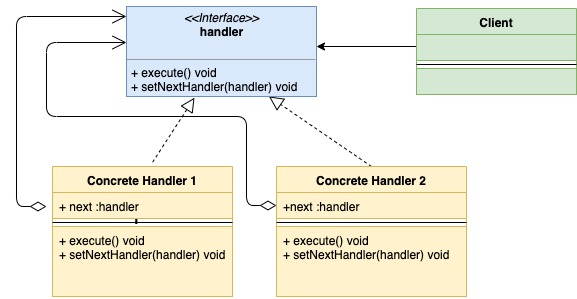

# Шаблон проектирования "Цепочка Обязанностей" в Go

[Оригинал](https://golangbyexample.com/chain-of-responsibility-design-pattern-in-golang/)

## Определение

Цепочка Обязанностей — это поведенческий шаблон проектирования. Он позволяет вам
создать цепочку обработчиков запроса. Каждый входящий запрос передаётся по цепочке
и каждый обработчик:

1. Обрабатывает запрос или нет.
2. Решает передавать ли запрос следующему обработчику в цепочке или нет.

Шаблон проектирования "Цепочка Обязанностей" будет лучше всего понятен на 
примере. Рассмотрим пример с больницей. В больнице существует несколько отделов,
а именно:

1. Регистратура.
2. Кабинет врача.
3. Комната выдачи медикаментов.
4. Касса.

Каждый раз, когда приходит пациент, он сначала идет в регистратуру, затем к врачу,
потом в комнату выдачи медикаментов, кассу и так далее. В некотором смысле, 
пациента направляют по цепочке и когда она заканчивается, его могут направить в 
другие отделы. Вот где можно использовать шаблон проектирования "Цепочка 
Обязанностей".

## Когда стоит использовать

* шаблон применим, когда существуют разные способы обработки одного и того же
запроса.
* когда вы не хотите, чтобы клиент выбирал обработчика, поскольку несколько 
обработчиков могут обрабатывать запрос. Кроме того, вы хотите отделить клиента
от обработчиков. Клиенту нужно знать только первый элемент в цепочке.
  
В примере больницей пациент сначала идет в регистратуру, а затем, основываясь на
текущем состоянии пациента, она оправляет его следующему обработчику в цепочке.

## UML диаграмма:



Ниже приведена соответствующая UML диаграмма для примера с больницей, описанного 
выше.


В таблице представлено соответствие между актёрами на UML диаграмме и файлами
из примера.

|  Актёр на UML диаграмме  | Файл из примера |
|:--------:|:-------:|
| handler  | interfaces/department.go  |
| Concrete Product 1 | hospital/reception.go |
| Concrete Product 2 | hospital/doctor.go |
| Concrete Handler 3 | hospital/medical.go |
| Concrete Handler 4 | hospital/cashier.go |
| Client  | main.go |

## Пример:

**interfaces/department.go**

```go
type Department interface {
    Execute(*patient.Patient)
    SetNext(Department)
}
```

**hospital/reception.go**

```go
type reception struct {
    next interfaces.Department
}

func NewReception() *reception {
    return &reception{}
}

func (r *reception) Execute(p *patient.Patient) {
    if p.RegistrationDone {
        fmt.Println("Patient registration already done")
        r.next.Execute(p)
        return
    }
    fmt.Println("Reception registering patient")
    p.RegistrationDone = true
    r.next.Execute(p)
}

func (r *reception) SetNext(next interfaces.Department) {
    r.next = next
}
```

**hospital/doctor.go**

```go
type doctor struct {
    next interfaces.Department
}

func NewDoctor() *doctor {
    return &doctor{}
}

func (d *doctor) Execute(p *patient.Patient) {
    if p.DoctorCheckUpDone {
        fmt.Println("Doctor checkup already done")
        d.next.Execute(p)
        return
    }
    fmt.Println("Doctor checking patient")
    p.DoctorCheckUpDone = true
    d.next.Execute(p)
}

func (d *doctor) SetNext(next interfaces.Department) {
    d.next = next
}
```

**hospital/medical.go**

```go
type medical struct {
    next interfaces.Department
}

func NewMedical() *medical {
    return &medical{}
}

func (m *medical) Execute(p *patient.Patient) {
    if p.MedicineDone {
        fmt.Println("Medicine already given to patient")
        m.next.Execute(p)
        return
    }
    fmt.Println("Medical giving medicine to patient")
    p.MedicineDone = true
    m.next.Execute(p)
}

func (m *medical) SetNext(next interfaces.Department) {
    m.next = next
}
```

**hospital/cashier.go**

```go
type cashier struct {
    next interfaces.Department
}

func NewCashier() *cashier {
    return &cashier{}
}

func (c *cashier) Execute(p *patient.Patient) {
    if p.PaymentDone {
        fmt.Println("Payment Done")
    }
    fmt.Println("Cashier getting money from patient")
}

func (c *cashier) SetNext(next interfaces.Department) {
    c.next = next
}
```

**main.go**

```go
func main() {
    cashier := hospital.NewCashier()
    // Определяем куда отправить пациент после комнаты выдачи медикаментов
    medical := hospital.NewMedical()
    medical.SetNext(cashier)
    // Определяем куда отправить пациент после кабинета врача
    doctor := hospital.NewDoctor()
    doctor.SetNext(medical)
    // Определяем куда отправить пациент после регистратуры
    reception := hospital.NewReception()
    reception.SetNext(doctor)
    hospitalPatient := patient.NewPatient("abc")
    // Пациент приходит в больницу
    reception.Execute(hospitalPatient)
}
```

Результат в терминале:

```shell
go run main.go
Reception registering patient
Doctor checking patient
Medical giving medicine to patient
Cashier getting money from patient
```