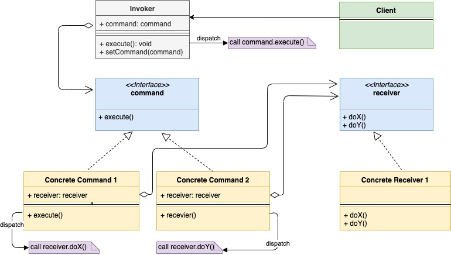

# Шаблон проектирования "Команда" в Go

[Оригинал](https://golangbyexample.com/command-design-pattern-in-golang/)

## Введение

Шаблон "Команда" — это поведенческий шаблон проектирования. Он предлагает 
инкапсулировать запрос как отдельный объект. Созданный объект имеет всю 
информацию о запросе и поэтому может выполнять его независимо.

Основные компоненты, которые используются в шаблоне проектирования "Команда":

* **Получатель** — это класс, который содержит бизнес-логику. Команды просто перенаправляют 
свои запросы получателю.

* **Команда** — содержит получателя и связана с определенным действием получателя.

* **Отправитель** - хранит команду и вызывает ее, выполняя метод `execute` команды.

* **Клиент** - создает команду с соответствующим получателем, передавая получателя
в конструктор команды. После этого он также связывает полученную команду с 
отправителем.

Давайте рассмотрим пример, после которого станет понятно почему полезен шаблон
"Команда". Представьте себе телевизор. Телевизор можно включить либо

1. С кнопки включения на пульте.
2. С кнопки на телевизоре.

Нажатие на эти кнопки делает одно и то же, включает телевизор. Чтобы включить 
телевизор, мы можем реализовать объект-команду ON, где получателем будет телевизор.
Когда для этого объекта-команды ON выполняется метод execute(), он в свою 
очередь вызывает функцию TV.on(). Итак, в этом случае:

* **Получатель** — телевизор
* **Команда** - это объект-команда ON, которая содержит телевизор.
* **Отправитель** - это **кнопка включения** на пульте или телевизоре. Обе хранят
  **объект-команду ON**
  
Обратите внимание, что запрос на включение телевизора обернут в объект-команду 
ON, которая может быть вызвана несколькими отправителями. Этот объект-команда ON,
которая содержит получатель (здесь телевизор) и может выполняться независимо.

В качестве другого примера представьте себе приложение Adobe Photoshop. В 
Photoshop сохранить файл можно тремя способами.

1. Из меню.
2. Из кнопки на верхней панели управления.
3. Используя сочетание клавиш `Ctrl+S`.

Всё три способа делают одно и то же, т. е. сохраняют изображение в приложении. 
Операцию сохранения можно поместить в объект-команду Save, где получателем будет
текущее изображение, открытое в приложении.

Рассмотрим преимущества создания отдельного объекта-команды в вышеприведенных
примерах.

1. Позволяет отделить пользовательский интерфейс от связанной с ним бизнес-логики.
2. Не нужно создавать различные обработчики для каждого отправителя.
3. Объект-команда содержит всю информацию, необходимую ей для выполнения. 
   Следовательно, её можно также использовать для отложенного выполнения.
   
Давайте взглянем на UML диаграмму.

## UML диаграмма: 

* Обратите внимание как команда хранится в Invoker (Отправитель). Запрос посылается в
  Invoker, а он передаёт его во встроенный объект-команду.
* все реализации объектов-команд (Concrete Command) содержат получателя.



В таблице представлено соответствие между актёрами на UML диаграмме и файлами
из примера.

|  Актёр на UML диаграмме  | Файл из примера |
|:--------:|:-------:|
| Invoker  | tv/button.go  |
| Command Interface  | interfaces/command.go  |
| Concrete Command 1 | tv/onCommand.go  |
| Concrete Command 2 | tv/offCommand.go |
| Receiver Interface | interfaces/device.go |
| Concrete Receiver | tv/tv.go |
| Client   | main.go |

**tv/button.go**

```go
type button struct {
    command interfaces.Command
}

func NewButton(command interfaces.Command) *button {
    return &button{
        command: command,
    }
}

func (b *button) Press() {
    b.command.Execute()
}
```

**interfaces/command.go**

```go
type Command interface {
    Execute()
}
```

**tv/onCommand.go**

```go
type onCommand struct {
    device interfaces.Device
}

func NewOnCommand(device interfaces.Device) *onCommand {
    return &onCommand{
        device: device,
    }
}

func (c *onCommand) Execute() {
    c.device.On()
}
```

**tv/offCommand.go**

```go
type offCommand struct {
    device interfaces.Device
}

func NewOffCommand(device interfaces.Device) *offCommand {
    return &offCommand{
        device: device,
    }
}

func (c *offCommand) Execute() {
    c.device.Off()
}
```

**interfaces/device.go**

```go
type Device interface {
    On()
    Off()
}
```

**tv/tv.go**

```go
type tv struct {
    isRunning bool
}

func NewTv() *tv {
    return &tv{}
}

func (t *tv) On() {
    t.isRunning = true
    fmt.Println("Turning tv on")
}

func (t *tv) Off() {
    t.isRunning = false
    fmt.Println("Turning tv off")
}
```

**main.go**

```go
func main() {
    tv1 := tv.NewTv()
    onCommand := tv.NewOnCommand(tv1)
    offCommand := tv.NewOffCommand(tv1)
    onButton := tv.NewButton(onCommand)
    onButton.Press()
    offButton := tv.NewButton(offCommand)
    offButton.Press()
}
```

Результат в терминале:

```shell
go run main.go
Turning tv on
Turning tv off
```