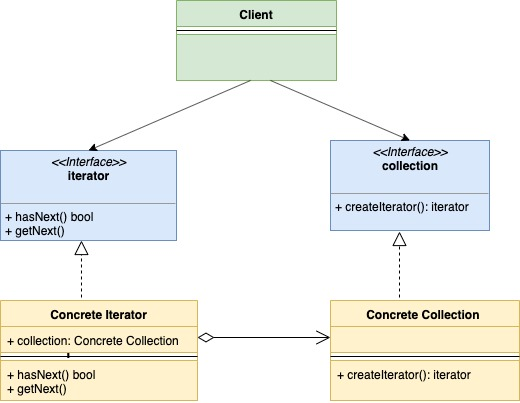

# Шаблон проектирования "Итератор" в Go

[Оригинал](https://golangbyexample.com/go-iterator-design-pattern/)

## Введение

Шаблон "Итератор" - это поведенческий шаблон проектирования. В этом шаблоне
структура-коллекция предоставляет итератор, который позволяет последовательно 
пройтись по каждому элементу в структуре-коллекции, не раскрывая её внутреннюю 
реализацию.

Ниже приведены основные компоненты шаблона проектирования "Итератор".

* **Интерфейс итератора**: этот интерфейс обеспечивает базовые операции, такие как 
`hasNext()`, `getNext()` и т. д. Эти операции, как следует из названия, 
позволяют перемещаться по коллекции, начать итерацию с начала и т. д.

* **Интерфейс коллекции**: этот интерфейс определяет коллекцию, которую необходимо
обойти. В нём определен метод `createIterator()`, который возвращает тип итератора.
  
* **Реализация итератора**: конкретная реализация интерфейса итератора

* **Реализация коллекции**: конкретная реализация интерфейса коллекции

Основная идея, лежащая в основе этого шаблона, заключается в том, чтобы перенести
логику итерации по структуре Collection в другой объект (реализующий интерфейс
итератора), в котором описан обобщенный метод перебора коллекции независимо
от ее типа.

## UML диаграмма:



В таблице представлено соответствие между актёрами на UML диаграмме и файлами
из примера.

|  Актёр на UML диаграмме  | Файл из примера |
|:--------:|:-------:|
| Collection  | interfaces/collection.go  |
| Concrete Collection | user/userCollection.go  |
| Iterator | interfaces/iterator.go |
| Concrete Iterator 1 | user/userIterator.go |
| Client   | main.go |

**interfaces/collection.go**

```go
type Collection interface {
    CreateIterator() Iterator
}
```

**user/userCollection.go**

```go
type userCollection struct {
    users []*model.User
}

func NewUserCollection(users []*model.User) *userCollection {
    return &userCollection{
        users: users,
    }
}

func (u *userCollection) CreateIterator() interfaces.Iterator {
    return &userIterator{
        users: u.users,
    }
}
```

**interfaces/iterator.go**

```go
type Iterator interface {
    HasNext() bool
    GetNext() *model.User
}
```

**user/userIterator.go**

```go
type userIterator struct {
    index int
    users []*model.User
}

func (u *userIterator) HasNext() bool {
    if u.index < len(u.users) {
        return true
    }
    return false
}

func (u *userIterator) GetNext() *model.User {
    if u.HasNext() {
        user := u.users[u.index]
        u.index++
        return user
    }
    return nil
}
```

**main.go**

```go
func main() {
    user1 := model.NewUser("a", 30)
    user2 := model.NewUser("b", 20)
    userCollection := user.NewUserCollection([]*model.User{user1, user2})
    iterator := userCollection.CreateIterator()
    for iterator.HasNext() {
        currentUser := iterator.GetNext()
        fmt.Printf("User is %+v\n", currentUser)
    }
}
```

Результат в терминале:

```shell
go run main.go
User is &{name:a age:30}
User is &{name:b age:20}
```