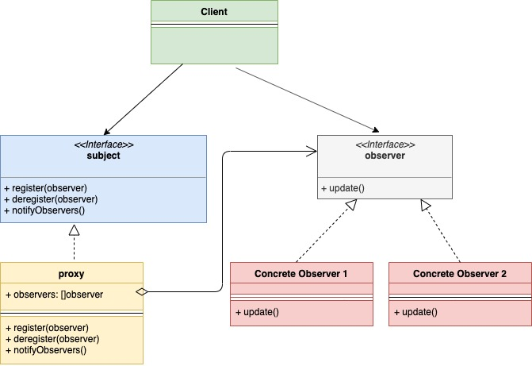

# Шаблон проектирования "Наблюдатель" в Go

[Оригинал](https://golangbyexample.com/observer-design-pattern-golang/)

## Введение

Шаблон "Наблюдатель" - это поведенческий шаблон проектирования. Этот шаблон 
позволяет экземпляру (называемому **субъектом**) публиковать события для других 
нескольких экземпляров (называемых **наблюдателями**). Эти **наблюдатели** 
подписываются на **субъект** и, следовательно, получают уведомления о событиях 
в случае каких-либо изменений в нём.

Рассмотрим пример. На сайте интернет-магазина многие товары не в наличии. Некоторых
покупателей может интересовать такой товар. Есть три решения этой проблемы:

1. Покупатель периодически проверяет наличие товара.
2. Интернет-магазин отправляет уведомления клиентам о всех новинках, которые есть
   в наличии.
3. Клиент подписывается только на конкретный товар, который ему интересен и 
   получает уведомление, если этот товар появляется в наличии. Кроме того, 
   несколько клиентов могут подписаться на один и тот же товар.
   
Вариант 3 наиболее жизнеспособен и в этом заключается суть шаблона "Наблюдатель".
Основными компонентами шаблона "Наблюдатель" являются:

1. **Субъект** — это экземпляр, который публикует событие, когда что-либо изменяется.
2. **Наблюдатель** - подписывается на субъект и получает уведомления о событиях.

Как правило, **Субъект** и **Наблюдатель** реализуются в виде интерфейса. В приложении
используются их реализации.

## UML диаграмма:



В таблице представлено соответствие между актёрами на UML диаграмме и файлами
из примера.

|  Актёр на UML диаграмме  | Файл из примера |
|:--------:|:-------:|
| Subject  | interfaces/subject.go  |
| Concrete Subject  | shop/item.go  |
| Observer | interfaces/observer.go |
| Concrete Observer | shop/customer.go |
| Client   | main.go |

## Пример:

**interfaces/subject.go**

```go
type Subject interface {
    Register(observer Observer)
    Deregister(observer Observer)
    NotifyAll()
}
```

**shop/item.go**

```go
type item struct {
    observerList []interfaces.Observer
    name         string
    inStock      bool
}

func NewItem(name string) *item {
    return &item{
        name: name,
    }
}

func (i *item) UpdateAvailability() {
    fmt.Printf("Item %s is now in stock\n", i.name)
    i.inStock = true
    i.NotifyAll()
}

func (i *item) Register(o interfaces.Observer) {
    i.observerList = append(i.observerList, o)
}

func (i *item) Deregister(o interfaces.Observer) {
    i.observerList = removeFromSlice(i.observerList, o)
}

func (i *item) NotifyAll() {
    for _, observer := range i.observerList {
        observer.Update(i.name)
    }
}

func removeFromSlice(observerList []interfaces.Observer, observerToRemove interfaces.Observer) []interfaces.Observer {
    observerListLength := len(observerList)
    for i, observer := range observerList {
        if observerToRemove.GetID() == observer.GetID() {
            observerList[observerListLength-1], observerList[i] = observerList[i], observerList[observerListLength-1]
            return observerList[:observerListLength-1]
        }
    }
    return observerList
}
```

**interfaces/observer.go**

```go
type Observer interface {
    Update(s string)
    GetID() string
}
```

**shop/customer.go**

```go
type customer struct {
    id string
}

func NewCustomer(id string) *customer {
    return &customer{
        id: id,
    }
}

func (c *customer) Update(itemName string) {
    fmt.Printf("Sending email to customer %s for item %s\n", c.id, itemName)
}

func (c *customer) GetID() string {
    return c.id
}
```

**main.go**

```go
func main() {
    shirtItem := shop.NewItem("Nike Shirt")
    observerFirst := shop.NewCustomer("abc@gmail.com")
    observerSecond := shop.NewCustomer("xyz@gmail.com")
    shirtItem.Register(observerFirst)
    shirtItem.Register(observerSecond)
    shirtItem.UpdateAvailability()
}
```

Результат в терминале:

```shell
go run main.go
Item Nike Shirt is now in stock
Sending email to customer abc@gmail.com for item Nike Shirt
Sending email to customer xyz@gmail.com for item Nike Shirt
```