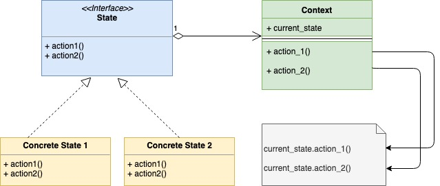

# Шаблон проектирования "Состояние" в Go

[Оригинал](https://golangbyexample.com/state-design-pattern-go/)

## Определение

Шаблон "Состояние" - это поведенческий шаблон проектирования, основанный на конечном
автомате. Мы объясним шаблон проектирования "Состояние" на примере торгового 
автомата. Для простоты предположим, что в торговом автомате есть только один тип
товара или продукта. Также предположим, что торговый автомат может находиться в
четырёх состояниях:

1. **hasItem**
2. **noItem**
3. **itemRequested**
4. **hasMoney**

Торговый автомат также может выполнять различные действия. Опять же для простоты
предположим, что доступны только четыре действия:

1. **Выбирать товар**
2. **Добавлять товар**
3. **Принимать деньги**
4. **Выдавать товар**

## Когда стоит использовать

* **Используйте шаблон проектирования "Состояние", когда объект может быть в различных
состояниях. В зависимости от текущего запроса объекту необходимо изменять свое 
текущее состояние.**
 * В приведенном выше примере торговый автомат может находиться в разных 
   состояниях. Торговый автомат будет переходить из одного состояния в другое. 
   Допустим, торговый автомат находится в состоянии itemRequested, после чего 
   он перейдет в состояние hasMoney как только действие "Приём денег" будет 
   завершено.
* **Используйте шаблон, когда объект может по-разному отвечать на один и тот же 
  запрос в зависимости от текущего состояния. В этом случае использование шаблона 
  проектирования "Состояние" заменит множество условных операторов.**
 * Например, в случае с торговым автоматом, если пользователь хочет купить товар, 
   автомат продолжит работу, если он находится в состоянии **hasItem** или 
   прекратит при состоянии **noItem**. Обратите внимание на поведение торгового 
   автомата в коде. В файле vendingMachine.go нет каких-либо условных выражений. 
   Вся логика работы реализуется с помощью состояний.
   
## UML диаграмма



В таблице представлено соответствие между актёрами на UML диаграмме и файлами
из примера.

|  Актёр на UML диаграмме  | Файл из примера |
|:--------:|:-------:|
| Context  | machine/vendingMachine.go  |
| State Interface  | interfaces/state.go  |
| Concrete State 1 | machine/noItemState.go |
| Concrete State 2 | machine/hasItemState.go |
| Concrete State 3 | machine/itemRequestedState.go |
| Concrete State 4 | machine/hasMoneyState.go |

## Пояснение:

* Здесь у нас существует интерфейс "Состояние", в котором определены сигнатуры функций,
представляющие действия, выполняемые торговым автоматом. Ниже приведены сигнатуры функций
1. `addItem(int) error`
2. `requestItem() error`
3. `insertMoney(money int) error`
4. `dispenseItem() error`
* Для каждого состояния реализованы все четыре вышеприведенные функции и происходит 
  переход в какое-то другое состояние при каждом действии или выдаётся какой-то 
  ответ.
* У каждого конкретного состояния есть указатель на текущий объект торгового автомата, 
  чтобы переход из одного состояния в другое происходил корректно.
  
Код примера показан ниже.

## Пример:

**machine/vendingMachine.go**

```go
type VendingMachine struct {
    HasItem       interfaces.State
    ItemRequested interfaces.State
    HasMoney      interfaces.State
    NoItem        interfaces.State
    
    currentState interfaces.State
    
    ItemCount int
    ItemPrice int
}

func NewVendingMachine(itemCount, itemPrice int) *VendingMachine {
    v := &VendingMachine{
        ItemCount: itemCount,
        ItemPrice: itemPrice,
    }
    
    hasItemState := NewHasItemState(v)
    itemRequestedState := NewItemRequestedState(v)
    hasMoneyState := NewHasMoneyState(v)
    noItemState := NewNoItemState(v)
    
    v.SetState(hasItemState)
    v.HasItem = hasItemState
    v.ItemRequested = itemRequestedState
    v.HasMoney = hasMoneyState
    v.NoItem = noItemState
    return v
}

func (v *VendingMachine) RequestItem() error {
    return v.currentState.RequestItem()
}

func (v *VendingMachine) AddItem(count int) error {
    return v.currentState.AddItem(count)
}

func (v *VendingMachine) InsertMoney(money int) error {
    return v.currentState.InsertMoney(money)
}

func (v *VendingMachine) DispenseItem() error {
    return v.currentState.DispenseItem()
}

func (v *VendingMachine) SetState(s interfaces.State) {
    v.currentState = s
}

func (v *VendingMachine) IncrementItemCount(count int) {
    fmt.Printf("Adding %d items\n", count)
    v.ItemCount = v.ItemCount + count
}
```

**interfaces/state.go**

```go
type State interface {
    AddItem(int) error
    RequestItem() error
    InsertMoney(money int) error
    DispenseItem() error
}
```

**machine/noItemState.go**

```go
type noItemState struct {
    vendingMachine *VendingMachine
}

func NewNoItemState(vendingMachine *VendingMachine) *noItemState {
    return &noItemState{
        vendingMachine: vendingMachine,
    }
}

func (i *noItemState) RequestItem() error {
    return fmt.Errorf("item out of stock")
}

func (i *noItemState) AddItem(count int) error {
    i.vendingMachine.IncrementItemCount(count)
    i.vendingMachine.SetState(i.vendingMachine.HasItem)
    return nil
}

func (i *noItemState) InsertMoney(money int) error {
    return fmt.Errorf("item out of stock")
}

func (i *noItemState) DispenseItem() error {
    return fmt.Errorf("item out of stock")
}
```

**machine/hasItemState.go**

```go
type hasItemState struct {
    vendingMachine *VendingMachine
}

func NewHasItemState(vendingMachine *VendingMachine) *hasItemState {
    return &hasItemState{
        vendingMachine: vendingMachine,
    }
}

func (i *hasItemState) RequestItem() error {
    if i.vendingMachine.ItemCount == 0 {
        i.vendingMachine.SetState(i.vendingMachine.NoItem)
        return fmt.Errorf("no item present")
    }
    fmt.Printf("Item requested\n")
    i.vendingMachine.SetState(i.vendingMachine.ItemRequested)
    return nil
}

func (i *hasItemState) AddItem(count int) error {
    fmt.Printf("%d items added\n", count)
    i.vendingMachine.IncrementItemCount(count)
    return nil
}

func (i *hasItemState) InsertMoney(money int) error {
    return fmt.Errorf("please select item first")
}

func (i *hasItemState) DispenseItem() error {
    return fmt.Errorf("please select item first")
}
```

**machine/itemRequestedState.go**

```go
type itemRequestedState struct {
    vendingMachine *VendingMachine
}

func NewItemRequestedState(vendingMachine *VendingMachine) *itemRequestedState {
    return &itemRequestedState{
        vendingMachine: vendingMachine,
    }
}

func (i *itemRequestedState) RequestItem() error {
    return fmt.Errorf("item already requested")
}

func (i *itemRequestedState) AddItem(count int) error {
    return fmt.Errorf("item dispense in progress")
}

func (i *itemRequestedState) InsertMoney(money int) error {
    if money < i.vendingMachine.ItemPrice {
        return fmt.Errorf("insert money is less. Please insert %d", i.vendingMachine.ItemPrice)
    }
    fmt.Println("Money entered is ok")
    i.vendingMachine.SetState(i.vendingMachine.HasMoney)
    return nil
}

func (i *itemRequestedState) DispenseItem() error {
    return fmt.Errorf("please insert money first")
}
```

**machine/hasMoneyState.go**

```go
type hasMoneyState struct {
    vendingMachine *VendingMachine
}

func NewHasMoneyState(vendingMachine *VendingMachine) *hasMoneyState {
    return &hasMoneyState{
        vendingMachine: vendingMachine,
    }
}

func (i *hasMoneyState) RequestItem() error {
    return fmt.Errorf("item dispense in progress")
}

func (i *hasMoneyState) AddItem(count int) error {
    return fmt.Errorf("item dispense in progress")
}

func (i *hasMoneyState) InsertMoney(money int) error {
    return fmt.Errorf("item out of stock")
}

func (i *hasMoneyState) DispenseItem() error {
    fmt.Println("Dispensing Item")
    i.vendingMachine.ItemCount = i.vendingMachine.ItemCount - 1
    if i.vendingMachine.ItemCount == 0 {
        i.vendingMachine.SetState(i.vendingMachine.NoItem)
    } else {
        i.vendingMachine.SetState(i.vendingMachine.HasItem)
    }
    return nil
}
```

**main.go**

```go
func main() {
    vendingMachine := machine.NewVendingMachine(1, 10)
    err := vendingMachine.RequestItem()
    if err != nil {
        log.Fatalf(err.Error())
    }
    err = vendingMachine.InsertMoney(10)
    if err != nil {
        log.Fatalf(err.Error())
    }
    err = vendingMachine.DispenseItem()
    if err != nil {
        log.Fatalf(err.Error())
    }
    
    fmt.Println()
    err = vendingMachine.AddItem(2)
    if err != nil {
        log.Fatalf(err.Error())
    }
    
    fmt.Println()
    
    err = vendingMachine.RequestItem()
    if err != nil {
        log.Fatalf(err.Error())
    }
    
    err = vendingMachine.InsertMoney(10)
    if err != nil {
        log.Fatalf(err.Error())
    }
    
    err = vendingMachine.DispenseItem()
    if err != nil {
        log.Fatalf(err.Error())
    }
}
```

Результат в терминале:

```shell
go run main.go
Item requested
Money entered is ok
Dispensing Item

Adding 2 items

Item requested
Money entered is ok
Dispensing Item
```