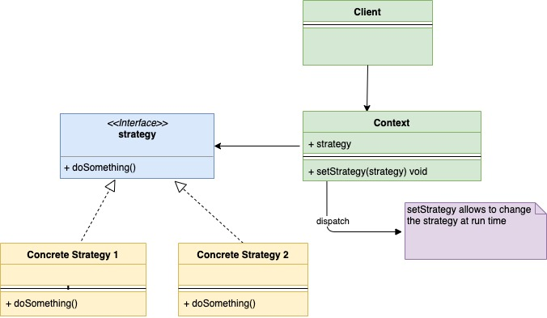

# Шаблон проектирования "Стратегия" в Go

[Оригинал](https://golangbyexample.com/strategy-design-pattern-golang/)

## Определение

Шаблон "Стратегия" - это поведенческий шаблон проектирования. Он позволяет вам 
изменять поведение объекта во время выполнения программы без каких-либо изменений 
в классе этого объекта.

Давайте разберём шаблон "Стратегия" на примере. Предположим вы создаёте кэш в 
памяти. Поскольку это кэш в памяти, он имеет ограниченный размер. Когда он 
достигает своего максимального размера, некоторые старые записи из кэша должны 
быть удалены. Чистку кэша можно осуществлять несколькими способами. Некоторыми
из них являются:

1. **LRU** - Least Recently Used: удаляется запись, которая использовалась меньше 
   всего в последнее время.
2. **FIFO** - First In First Out: удаляется запись, которая была создана первой.
3. **LFU** - Least Frequently Used: удаляется на наименее часто используемая запись.

Теперь проблема заключается в том как отделить наш класс `Cache` от алгоритма,
чтобы мы могли менять его во время выполнения программы. Также класс Cache не 
должен изменяться при добавлении нового алгоритма. Вот где можно использовать
шаблон "Стратегия". В качестве решения он предлагает создать семейство алгоритмов,
каждый из которых имеет свой класс. Каждый из этих классов удовлетворяет одному 
и тому же интерфейсу и это делает алгоритм взаимозаменяемым внутри семейства. Пусть
интерфейс называется **evictionAlgo**.

Теперь в наш основной класс **Cache** будет встроен интерфейс **evictionAlgo**. Вместо
того, чтобы реализовать все типы алгоритмов чистки внутри себя, наш класс Cache
делегирует эту работу интерфейсу **evictionAlgo**. Поскольку **evictionAlgo** - 
интерфейс, мы можем изменить алгоритм на LRU, FIFO, LFU во время выполнения
программы без каких-либо изменений в классе **Cache**.

## Когда стоит использовать

* Когда объекту необходимо поддерживать различное поведение, и вы хотите 
  изменить поведение во время выполнения.
* Когда вы хотите избежать множества условий при выборе поведения во время 
  выполнения.
* Когда существуют различные похожие друг на друга алгоритмы и они отличаются 
  только какой-то определенной частью.

## UML диаграмма

Обратите внимание на UML диаграмму ниже: в контекст (`Cache`) строен интерфейс
стратегии (`evictionAlgo`).



Ниже приведена соответствующая UML диаграмма для приведенного выше примера.


В таблице представлено соответствие между актёрами на UML диаграмме и файлами
из примера.

|  Актёр на UML диаграмме  | Файл из примера |
|:--------:|:-------:|
| Context  | cache/cache.go  |
| Strategy  | interfaces/evictionAlgo.go  |
| Concrete Strategy Object 1 | cache/lfu.go |
| Concrete Strategy Object 2 | cache/lru.go |
| Concrete Strategy Object 3 | cache/fifo.go |
| Client | main.go |

## Пример:

**cache/cache.go**

```go
type cache struct {
    storage      map[string]string
    evictionAlgo interfaces.EvictionAlgo
    capacity     int
    maxCapacity  int
}

func InitCache(e interfaces.EvictionAlgo) *cache {
    storage := make(map[string]string)
    return &cache{
        storage:      storage,
        evictionAlgo: e,
        capacity:     0,
        maxCapacity:  2,
    }
}

func (c *cache) SetEvictionAlgo(e interfaces.EvictionAlgo) {
    c.evictionAlgo = e
}

func (c *cache) Add(key, value string) {
    if c.capacity == c.maxCapacity {
        c.Evict()
    }
    c.capacity++
    c.storage[key] = value
}

func (c *cache) Get(key string) {
    delete(c.storage, key)
}

func (c *cache) Evict() {
    c.evictionAlgo.Evict(c)
    c.capacity--
}
```

**interfaces/evictionAlgo.go**

```go
type Cache interface {
    SetEvictionAlgo(e EvictionAlgo)
    Add(key, value string)
    Get(key string)
    Evict()
}

type EvictionAlgo interface {
    Evict(c Cache)
}
```

**cache/lfu.go**

```go
type lfu struct {
}

func NewLfu() *lfu {
    return &lfu{}
}

func (l *lfu) Evict(c interfaces.Cache) {
    fmt.Println("Evicting by lfu strategy")
}
```

**cache/lru.go**

```go
type lru struct {
}

func NewLru() *lru {
    return &lru{}
}

func (l *lru) Evict(c interfaces.Cache) {
    fmt.Println("Evicting by lru strategy")
}
```

**cache/fifo.go**

```go
type fifo struct {
}

func NewFifo() *fifo {
    return &fifo{}
}

func (l *fifo) Evict(c interfaces.Cache) {
    fmt.Println("Evicting by fifo strategy")
}
```

**main.go**

```go
func main() {
    lfu := cache.NewLfu()
    cache1 := cache.InitCache(lfu)
    cache1.Add("a", "1")
    cache1.Add("b", "2")
    cache1.Add("c", "3")
    lru := cache.NewLru()
    cache1.SetEvictionAlgo(lru)
    cache1.Add("d", "4")
    fifo := cache.NewFifo()
    cache1.SetEvictionAlgo(fifo)
    cache1.Add("e", "5")
}
```

Результат в терминале:

```shell
go run main.go
Evicting by lfu strategy
Evicting by lru strategy
Evicting by fifo strategy
```