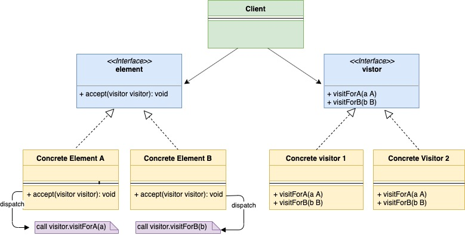
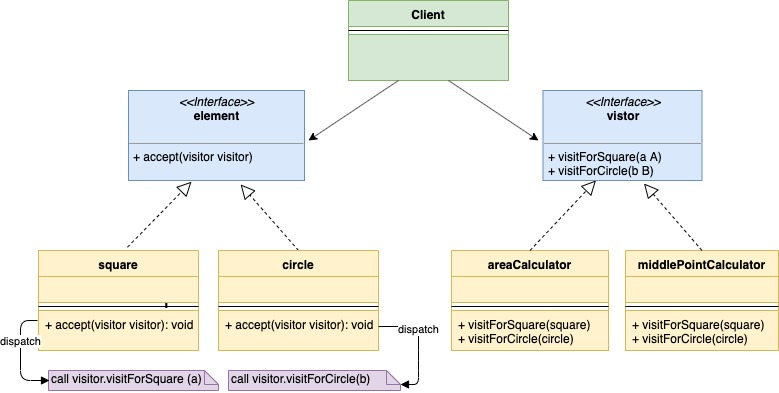

# Шаблон проектирования "Посетитель" в Go

[Оригинал](https://golangbyexample.com/visitor-design-pattern-go/)

## Введение

Шаблон "Посетитель" - это поведенческий паттерн проектирования, который позволяет 
добавлять поведение в структуру без фактического её изменения.

Давайте разберём шаблон "Посетитель" на примере. Допустим вы разработчик библиотеки,
в которой существуют различные геометрические фигуры, например

1. Квадрат
2. Окружность
3. Треугольник

Каждая из вышеприведенных структур реализует один и тот же интерфейс **shape**. 
В нашей компании много команд, которые используют вашу библиотеку. Теперь, 
предположим, что кто-то из команды хочет, чтобы вы добавили ещё одно поведение 
(метод **getArea()**) к этим фигурам.

Существует несколько вариантов решения этой проблемы

**Первый вариант**

Первый вариант, который приходит на ум, добавить метод **getArea()** в интерфейс
**shape** и затем в каждой фигуре реализовать метод `getArea()`. Этот вариант 
кажется самым простым, но существует несколько проблем:

* Как разработчик библиотеки, вы не хотите изменять тщательно протестированный код 
  своей библиотеки, добавляя дополнительное поведение.
* Команды, использующие вашу библиотеку, могут запросить больше вариантов 
  поведения, например, **getNumSides()**, **getMiddleCoordinates()**. В 
  этом случае вы не захотите постоянно менять свою библиотеку. Решением была бы
  возможность расширения библиотеки другими командами без существенной модификации
  кода.

**Второй вариант**

Второй вариант заключается в том, что команда, которой нужен дополнительный 
функционал, может сама реализовать логику поведения. Итак, они предложили следующий 
код, зависящий от типа фигуры

```go
if shape.type == square {
    // Вычисляем площадь квадрата
} elseif shape.type == circle {
    // Вычисляем площадь окружности
} elseif shape.type == "triangle" {
    // Вычисляем площадь треугольника
} else {
    // Выдаём ошибку
} 
```

Вышеприведенный код также содержит ряд проблем, поскольку вы не можете в полной 
мере использовать преимущества интерфейсов и вместо этого выполняете явную
проверку типа, которая является ненадёжной. Во-вторых, получение типа во время 
выполнения может повлиять на производительность или даже невозможна в некоторых
языках.

**Третий вариант**

Третий вариант — решить указанную выше проблему с помощью шаблона "Посетитель".
Мы определяем интерфейс `visitor` следующим образом

```go
type visitor interface {
    visitForSquare(square)
    visitForCircle(circle)
    visitForTriangle(triangle)
}
```

Функции **visitForSquare(square)**, **visitForCircle(circle)**, 
**visitForTriangle(triangle)** позволяют нам добавлять функционал в квадрат, 
окружность и треугольник соответственно.

Теперь возникает вопрос, почему не использовать один метод **visit(shape)** 
в интерфейсе `visitor`. Причина заключается в том, что Go, а также некоторые 
другие языки не поддерживают перегрузку методов. Таким образом, нужно использовать
отдельный метод для каждой структуры.

Мы добавим метод `accept` к интерфейсу фигуры с приведенной ниже сигнатурой и он 
должен быть определен во всех фигурах.

```go
func accept(v visitor)
```

Но мы только что говорили, что не хотим изменять существующие фигуры. При 
использовании шаблона "Посетитель" нам действительно нужно будет изменить наши 
фигуры, но это изменение выполняется только один раз. В случае добавления 
какого-либо дополнительного поведения, например, **getNumSides()**, 
**getMiddleCoordinates()** мы будем использовать ту же функцию **accept(v visitor)** 
больше, не изменяя фигуры. По сути фигуры нужно будет изменить единожды, а дальнейшие 
изменения в функционале будут реализованы в функции `accept`. Давайте 
посмотрим как.

В квадрате реализуем метод `accept` следующим образом:

```go
func (obj *squre) accept(v visitor){
    v.visitForSquare(obj)
}
```

Аналогично будет определена функция `accept` для окружности и треугольника.

Теперь команда, которой нужно поведение **getArea()**, может просто реализовать 
интерфейс `visitor` и записать логику вычисления площади для этой конкретной 
реализации.

```go
type areaCalculator struct{
    area int
}

func (a *areaCalculator) visitForSquare(s *square) {
    // Вычисляем площадь для квадрата
}
func (a *areaCalculator) visitForCircle(s *square) {
    // Вычисляем площадь для окружности
}
func (a *areaCalculator) visitForTriangle(s *square) {
    // Вычисляем площадь для треугольника
}
```

Чтобы вычислить площадь квадрата, мы сначала создаём экземпляр квадрата, а затем
просто вызываем:

```go
sq := &square{}
ac := &areaCalculator{}
sq.accept(ac)
```

Точно так же другая команда, которой нужно поведение **getMiddleCoordinates()**,
может определить другую реализацию интерфейса `visitor`, аналогичную описанной 
выше.

```go
type middleCoordinates struct {
    x int
    y int
}

func (a *middleCoordinates) visitForSquare(s *square) {
    // Вычисляем координаты центра масс квадрата. После вычисления присвоить их
    // в переменные x и y экземпляра.
}

func (a *middleCoordinates) visitForCircle(c *circle) {
    // Вычисляем координаты центра масс окружности. После вычисления присвоить их
    // в переменные x и y экземпляра.
}

func (a *middleCoordinates) visitForTriangle(t *triangle) {
    // Вычисляем координаты центра масс треугольника. После вычисления присвоить их
    // в переменные x и y экземпляра.
}
```

## UML диаграмма:



Ниже приведена соответствующая UML диаграмма для приведенного выше примера с фигурами и 
методом `areaCalculator`.



В таблице представлено соответствие между актёрами на UML диаграмме и файлами
из примера.


|  Актёр на UML диаграмме  | Файл из примера |
|:--------:|:-------:|
| element  | interfaces/shape.go  |
| Concrete Element A | shape/square.go |
| Concrete Element B | shape/circle.go |
| Concrete Element C | shape/triangle.go |
| Visitor | interfaces/visitor.go |
| Concrete Visitor 1 | visitor/areaCalculator.go |
| Concrete Visitor 2 | visitor/middleCoordinates.go |
| Client  | main.go |

**interfaces/shape.go**

```go
type Shape interface {
    GetType() string
    Accept(Visitor)
}
```

**shape/square.go**

```go
type square struct {
    side int
}

func NewSquare(side int) *square {
    return &square{
        side: side,
    }
}

func (s *square) Accept(v interfaces.Visitor) {
    v.VisitForSquare(s)
}

func (s *square) GetType() string {
    return "Square"
}
```

**shape/circle.go**

```go
type circle struct {
    radius int
}

func NewCircle(radius int) *circle {
    return &circle{
        radius: radius,
    }
}

func (c *circle) Accept(v interfaces.Visitor) {
    v.VisitForCircle(c)
}

func (c *circle) GetType() string {
    return "Circle"
}
```

**shape/triangle.go**
```go
type Triangle struct {
    a int
    b int
    c int
}

func NewTriangle(a, b, c int) *Triangle {
    return &Triangle{
        a: a,
        b: b,
        c: c,
    }
}

func (t *Triangle) Accept(v interfaces.Visitor) {
    v.VisitForTriangle(t)
}

func (t *Triangle) GetType() string {
    return "Triangle"
}
```

**interfaces/visitor.go**

```go
type Visitor interface {
    VisitForSquare(Shape)
    VisitForCircle(Shape)
    VisitForTriangle(Shape)
}
```

**visitor/areaCalculator.go**

```go
type areaCalculator struct {
	area int
}

func NewAreaCalculator() *areaCalculator {
    return &areaCalculator{}
}

func (a *areaCalculator) VisitForSquare(s interfaces.Shape) {
    // Вычисляем площадь для квадрата. После вычисления площади присваиваем её в
    // переменную area экземпляра
    fmt.Println("Calculating area for square")
}

func (a *areaCalculator) VisitForCircle(s interfaces.Shape) {
    // Вычисляем площадь для окружности. После вычисления площади присваиваем её в
    // переменную area экземпляра
    fmt.Println("Calculating area for circle")
}

func (a *areaCalculator) VisitForTriangle(s interfaces.Shape) {
    // Вычисляем площадь для треугольника. После вычисления площади присваиваем её в
    // переменную area экземпляра
    fmt.Println("Calculating area for triangle")
}
```

**visitor/middleCoordinates.go**

```go
type middleCoordinates struct {
    x int
    y int
}

func NewMiddleCoordinates() *middleCoordinates {
    return &middleCoordinates{}
}

func (mc *middleCoordinates) VisitForSquare(s interfaces.Shape) {
    // Вычисляем координаты центра масс квадрата. После вычисления присвоить их
    // в переменные x и y экземпляра.
    fmt.Println("Calculating middle point coordinates for square")
}

func (mc *middleCoordinates) VisitForCircle(s interfaces.Shape) {
    // Вычисляем координаты центра масс окружности. После вычисления присвоить их
    // в переменные x и y экземпляра.
    fmt.Println("Calculating middle point coordinates for circle")
}

func (mc *middleCoordinates) VisitForTriangle(s interfaces.Shape) {
    // Вычисляем координаты центра масс треугольника. После вычисления присвоить их
    // в переменные x и y экземпляра.
    fmt.Println("Calculating middle point coordinates for triangle")
}
```

**main.go**
```go
func main() {
    square := shape.NewSquare(2)
    circle := shape.NewCircle(3)
    triangle := shape.NewTriangle(1, 2, 3)
  
    areaCalculator := visitor.NewAreaCalculator()
    square.Accept(areaCalculator)
    circle.Accept(areaCalculator)
    triangle.Accept(areaCalculator)
  
    fmt.Println()
    middleCoordinates := visitor.NewMiddleCoordinates()
    square.Accept(middleCoordinates)
    circle.Accept(middleCoordinates)
    triangle.Accept(middleCoordinates)
}
```

Результат в терминале:

```shell
go run main.go
Calculating area for square
Calculating area for circle
Calculating area for triangle

Calculating middle point coordinates for square
Calculating middle point coordinates for circle
Calculating middle point coordinates for triangle
```