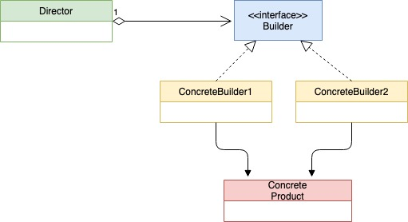

# Шаблон проектирования "Строитель" в Go

[Оригинал](https://golangbyexample.com/builder-pattern-golang/)

Шаблон "Строитель" - это порождающий шаблон проектирования, используемый для
создания сложных объектов. Ниже представлена UML диаграмма.



## Когда стоит использовать

* Используйте шаблон "Строитель", когда создаваемый объект очень большой и 
  состоит из нескольких стадий. Это помогает уменьшить размер конструктора. В нашем
  примере становится проще и уменьшается размер конструктора структуры `house`.
* Когда необходимо создать другую версию того же объекта. Например, в приведенном
  ниже коде существует две версии `house`: иглу и обычный дом, которые создают
  **iglooBuilder** и **normalBuilder**.
* Когда не может существовать частично инициализированного объекта. Опять же 
  ссылаясь на приведенный ниже код, дом будет либо создан полностью, либо
  не создан вообще. Структура Concrete Builder содержит временное состояние
  создаваемого объекта `house`.
  
## Пример

**interfaces/builder.go**

```go
type Builder interface {
    SetWindowType()
    SetDoorType()
    SetNumFloor()
    GetHouse() common.House
}
```

**common/house.go**

```go
package common

type House struct {
    windowType string
    doorType   string
    floor      int
}

func NewHouse(windowType string, doorType string, floor int) House {
    return House{
        windowType: windowType,
        doorType:   doorType,
        floor:      floor,
    }
}

func (h *House) GetWindowType() string {
    return h.windowType
}

func (h *House) GetDoorType() string {
    return h.doorType
}

func (h *House) GetFloor() int {
    return h.floor
}
```

**igloo/builder.go**

```go
type iglooBuilder struct {
    windowType string
    doorType   string
    floor      int
}

func NewIglooBuilder() *iglooBuilder {
    return &iglooBuilder{}
}

func (b *iglooBuilder) SetWindowType() {
    b.windowType = "Snow Window"
}

func (b *iglooBuilder) SetDoorType() {
    b.doorType = "Snow Door"
}

func (b *iglooBuilder) SetNumFloor() {
    b.floor = 1
}

func (b *iglooBuilder) GetHouse() common.House {
    return common.NewHouse(b.windowType, b.doorType, b.floor)
}
```

**normal/builder.go**

```go
type normalBuilder struct {
    windowType string
    doorType   string
    floor      int
}

func NewNormalBuilder() *normalBuilder {
    return &normalBuilder{}
}

func (b *normalBuilder) SetWindowType() {
    b.windowType = "Wooden Window"
}

func (b *normalBuilder) SetDoorType() {
    b.doorType = "Wooden Door"
}

func (b *normalBuilder) SetNumFloor() {
    b.floor = 2
}

func (b *normalBuilder) GetHouse() common.House {
    return common.NewHouse(b.windowType, b.doorType, b.floor)
}
```

**director.go**

```go
type director struct {
    builder interfaces.Builder
}

func NewDirector(b interfaces.Builder) *director {
    return &director{
        builder: b,
    }
}

func (d *director) SetBuilder(b interfaces.Builder) {
    d.builder = b
}

func (d *director) BuildHouse() common.House {
    d.builder.SetDoorType()
    d.builder.SetWindowType()
    d.builder.SetNumFloor()
    return d.builder.GetHouse()
}
```

**main.go**

```go
func getBuilder(builderType string) interfaces.Builder {
    if builderType == "normal" {
        return normal.NewNormalBuilder()
    }
    if builderType == "igloo" {
        return igloo.NewIglooBuilder()
    }
    return nil
}

func main() {
    normalBuilder := getBuilder("normal")
    iglooBuilder := getBuilder("igloo")
  
    director := NewDirector(normalBuilder)
    normalHouse := director.BuildHouse()
  
    fmt.Printf("Normal House Door Type: %s\n", normalHouse.GetDoorType())
    fmt.Printf("Normal House Window Type: %s\n", normalHouse.GetWindowType())
    fmt.Printf("Normal House Num Floor: %d\n", normalHouse.GetFloor())
  
    director.SetBuilder(iglooBuilder)
    iglooHouse := director.BuildHouse()
  
    fmt.Printf("\nIgloo House Door Type: %s\n", iglooHouse.GetDoorType())
    fmt.Printf("Igloo House Window Type: %s\n", iglooHouse.GetWindowType())
    fmt.Printf("Igloo House Num Floor: %d\n", iglooHouse.GetFloor())
}
```

Результат в терминале:

```shell
go run .
Normal House Door Type: Wooden Door
Normal House Window Type: Wooden Window
Normal House Num Floor: 2

Igloo House Door Type: Snow Door
Igloo House Window Type: Snow Window
Igloo House Num Floor: 1
```