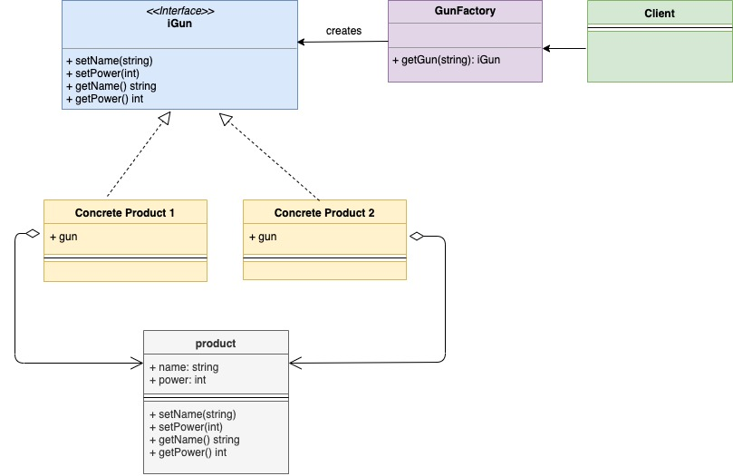

# Шаблон проектирования "Фабрика" в Go

[Оригинал](https://golangbyexample.com/golang-factory-design-pattern/)

Шаблон "Фабрика" - это порождающий шаблон проектирования, а также один из наиболее
часто используемых шаблонов. Этот шаблон позволяет скрыть логику создания 
генерируемых экземпляров.

Клиент взаимодействует только с фабричной структурой и сообщает, какие 
экземпляры необходимо создать. Класс фабрики взаимодействует с соответствующими 
конкретными структурами и возвращает правильный экземпляр.

В приведенном ниже примере:

* у нас есть интерфейс `Gun`, определяющий все методы, которые должны быть у 
  автоматического оружия. Существует структура `gun`, которая реализует интерфейс
  `Gun`.
* две конкретных реализации - `ak47` и `maverick`. В обе встроена структура 
  `gun` и, следовательно, оба неявно реализуют все методы `Gun` и отсюда `Gun` 
  типа.
* существует структура `gunFactory`, которая создаёт автоматическое оружие типа
  `ak47` и `maverick`.
* `main.go` здесь является клиентом и вместо непосредственно генерации `ak47` 
  или `maverick`, он полагается на `gunFactory`, которая создаёт экземпляры 
  `ak47` и `maverick`.

## Обобщенная UML диаграмма:  


Ниже приведена соответствующая UML диаграмма для примера, описанного выше.



В таблице представлено соответствие между актёрами на UML диаграмме и файлами
из примера.

|  Актёр на UML диаграмме  | Файл из примера |
|:--------:|:-------:|
|  ProductFactory  |   gunFactory.go  |
|  iProduct   |  gun.go  |
|  Product   |   gun.go  |
|  Concrete Product 1   |   ak47.go  |
| Concrete Product 2 | maverick.go |
| Client   | main.go |

## Пример

**interfaces/gun.go**

```go
type Gun interface {
    SetName(name string)
    SetPower(power int)
    GetName() string
    GetPower() int
}
```

**gun/common.go**

```go
type gun struct {
    name  string
    power int
}

func (g *gun) SetName(name string) {
    g.name = name
}

func (g *gun) GetName() string {
    return g.name
}

func (g *gun) SetPower(power int) {
    g.power = power
}

func (g *gun) GetPower() int {
    return g.power
}
```

**gun/ak47.go**

```go
type ak47 struct {
    gun
}

func NewAk47() interfaces.Gun {
    return &ak47{
        gun: gun{
            name:  "AK47 gun",
            power: 4,
        },
    }
}
```

**gun/maverick.go**

```go
type maverick struct {
    gun
}

func NewMaverick() interfaces.Gun {
    return &maverick{
        gun: gun{
            name:  "Maverick gun",
            power: 5,
        },
    }
}
```

**gun/factory.go**

```go
func GetGun(gunType string) (interfaces.Gun, error) {
    if gunType == "ak47" {
        return NewAk47(), nil
    }
    if gunType == "maverick" {
        return NewMaverick(), nil
    }
    return nil, errors.New("wrong gun type passed")
}
```

**main.go**

```go
func main() {
    ak47, err := gun.GetGun("ak47")
    if err != nil {
        log.Fatalf("Cannot create ak47 gun. Error %v", err)
    }
    maverick, err := gun.GetGun("maverick")
    if err != nil {
        log.Fatalf("Cannot create maverick gun. Error %v", err)
    }
    printDetails(ak47)
    printDetails(maverick)
}

func printDetails(g interfaces.Gun) {
    fmt.Printf("Gun: %s\n", g.GetName())
    fmt.Printf("Power: %d\n", g.GetPower())
}

```

Результат в терминале:

```shell
go run main.go
Gun: AK47 gun
Power: 4
Gun: Maverick gun
Power: 5
```