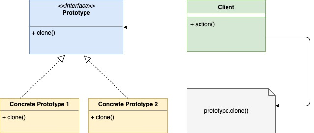

# Шаблон проектирования "Прототип" в Go

Шаблон "Прототип" - это порождающий шаблон проектирования, позволяющий создавать
копии объектов. В этом шаблоне отвечает за создание клонированных объектов
сам клонируемый объект.

Клонируемый объект предоставляет метод клонирования, который возвращает 
клонированную копию объекта.

## Когда стоит использовать

* Мы используем шаблон "Прототип", когда процесс создания клонируемого объекта
  сложен, например, клонирование может включать в себя создание глубоких копий, 
  иерархических копий и т.д. Более того объекте может содержать приватные поля,
  к которым нельзя получить доступ извне.
* Копия объекта создаётся вместо того, чтобы генерировать новый экземпляр с нуля. 
  Это предотвращает выполнение дорогостоящих операций при создании нового объекта,
  например, операций с базой данных.
* Когда вы хотите создать копию объекта, но он доступен вам только в качестве 
  интерфейса. Следовательно, вы не можете напрямую создавать копии этого объекта.
  
## UML диаграмма



В таблице представлено соответствие между актёрами на UML диаграмме и файлами
из примера.

|  Актёр на UML диаграмме  | Файл из примера |
|:--------:|:-------:|
|  Prototype interface  |   interfaces/node.go  |
|  Concrete Prototype 1   |   fileSystem/file.go  |
| Concrete Prototype 2 | fileSystem/folder.go |
| Client   | main.go |

## Пример

В качестве примера рассмотрим файловую систему ОС. В ней существуют папки и 
файлы и папки внутри себя могут содержать файлы и папки. Каждый файл и папка
могут быть представлены интерфейсом `Node`. Интерфейс `Node` также содержит 
функцию `clone()`.

**interfaces/node.go**

```go
type Node interface {
    Print(string)
    Clone() Node
}
```

Структура `file` представлена следующим образом:

**fileSystem/file.go**

```go
type file struct {
    name string
}

func NewFile(name string) *file {
    return &file{
        name: name,
    }
}

func (f *file) Print(indentation string) {
    fmt.Println(indentation + f.name)
}

func (f *file) Clone() interfaces.Node {
    return &file{name: f.name + "_clone"}
}
```

Структура `folder` представлена следующим образом:

**fileSystem/folder.go**

```go
type folder struct {
    children []interfaces.Node
    name     string
}

func NewFolder(children []interfaces.Node, name string) *folder {
    return &folder{
        children: children,
        name:     name,
    }
}

func (f *folder) Print(indentation string) {
    fmt.Println(indentation + f.name)
    for _, i := range f.children {
        i.Print(indentation + indentation)
    }
}

func (f *folder) Clone() interfaces.Node {
    cloneFolder := &folder{
        name: f.name + "_clone",
    }
    var tempChildren []interfaces.Node
    for _, i := range f.children {
        nodeCopy := i.Clone()
        tempChildren = append(tempChildren, nodeCopy)
    }
    cloneFolder.children = tempChildren
    return cloneFolder
}
```

Поскольку и структура `file`, и структура `folder` реализуют методы `Print` 
и `Clone`, они относятся к типу `Node`. Также обратите внимание на метод
`Clone` в `file` и `folder`. Функция `Clone` в обоих случаях возвращает 
копию соответствующего файла или папки. Чтобы отличать клон от оригинала, мы
добавляем суффикс `_clone` к имени поля. Правильность работы проверяется в функции
`main`.

**main.go**

```go
func main() {
    file1 := fileSystem.NewFile("File1")
    file2 := fileSystem.NewFile("File2")
    file3 := fileSystem.NewFile("File3")
    folder1 := fileSystem.NewFolder([]interfaces.Node{file1}, "Folder1")
    folder2 := fileSystem.NewFolder([]interfaces.Node{file1, file2, file3}, "Folder2")
    fmt.Println("Printing hierarchy for Folder 1")
    folder1.Print("    ")
    fmt.Println("\nPrinting hierarchy for Folder 2")
    folder2.Print("    ")
    cloneFolder := folder2.Clone()
    fmt.Println("\nPrinting hierarchy for Clone Folder 2")
    cloneFolder.Print("    ")
}
```

Результат в терминале:

```shell
go run main.go
Printing hierarchy for Folder 1
    Folder1
        File1

Printing hierarchy for Folder 2
    Folder2
        File1
        File2
        File3

Printing hierarchy for Clone Folder 2
    Folder2_clone
        File1_clone
        File2_clone
        File3_clone
```