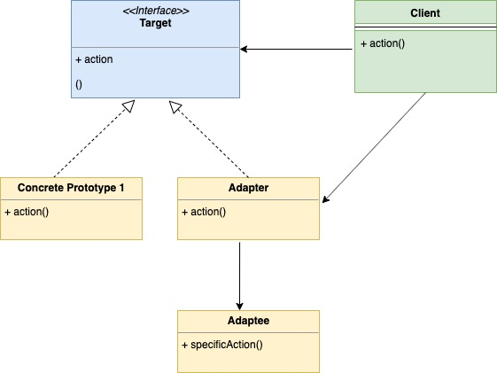
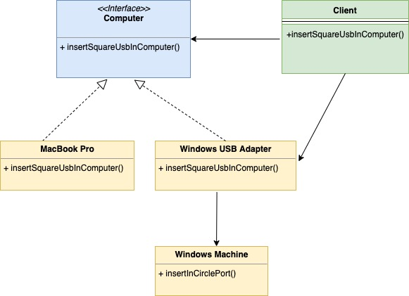

# Шаблон проектирования "Адаптер" в Go

[Оригинал](https://golangbyexample.com/adapter-design-pattern-go/)

## Введение

Шаблон проще всего понять на примере. Пусть у нас два вида ноутбуков

1. MacBook Pro
2. Windows Laptop

У MacBook Pro USB порт **квадратной** формы, а у Windows - USB порт **круглой** формы.
У вас есть USB-кабель квадратной формы, поэтому его можно вставить только в 
ноутбук Mac. Проблему можно определить следующим образом:

**Проблема:**

* У нас есть класс (`Client`), который ожидает, что у объекта будут определенные
  свойства (квадратный USB порт в данном случае), но существует ещё один объект,
  называемый `adaptee` (в данном случае Windows Laptop), который предлагает те
  же функции, но через другой интерфейс (порт круглой формы).
  
Здесь вступает в роль шаблон "Адаптер". Мы создадим класс `Adapter`, который
будет:

* использует тот же интерфейс, который ожидает клиент (здесь квадратный USB 
  порт).
* преобразует запрос от клиента к `adaptee` в той форме, которой он ожидает. По
  сути в нашем примере адаптер имеет квадратный USB порт и его можно вставить 
  в круглый порт на ноутбуке с Windows.

## Когда стоит использовать

Используйте этот шаблон проектирования, когда объекты реализуют другой 
интерфейс, чтобы они соответствовали требованиям клиента.



Ниже приведена соответствующая UML диаграмма для примера, описанного выше.



В таблице представлено соответствие между актёрами на UML диаграмме и файлами
из примера.

|  Актёр на UML диаграмме  | Файл из примера |
|:--------:|:-------:|
| Target  | interfaces/computer.go  |
| Concrete Product 1 |   computer/mac.go  |
| Concrete Product 2 (Adapter) | computer/windowsAdapter.go |
| Adaptee | computer/windows.go |
| Client   | computer/client.go |

## Пример:

**interfaces/computer.go**

```go
type Computer interface {
    InsertInSquarePort()
}
```

**computer/mac.go**

```go
type mac struct {
}

func NewMac() *mac {
    return &mac{}
}

func (m *mac) InsertInSquarePort() {
    fmt.Println("Insert square port into mac machine")
}
```

**computer/windowsAdapter.go**

```go
type windowsAdapter struct {
    windowMachine *windows
}

func NewWindowsAdapter(machine *windows) *windowsAdapter {
    return &windowsAdapter{
        windowMachine: machine,
    }
}

func (w *windowsAdapter) InsertInSquarePort() {
    w.windowMachine.insertInCirclePort()
}
```

**computer/windows.go**

```go
type windows struct {
}

func NewWindows() *windows {
    return &windows{}
}

func (w *windows) insertInCirclePort() {
    fmt.Println("Insert circle port into windows machine")
}
```

**computer/client.go**

```go
type client struct {
}

func NewClient() *client {
    return &client{}
}

func (c *client) InsertSquareUsbInComputer(com interfaces.Computer) {
    com.InsertInSquarePort()
}
```

**main.go**

```go
func main() {
    client := computer.NewClient()
    mac := computer.NewMac()
    client.InsertSquareUsbInComputer(mac)
    windowsMachine := computer.NewWindows()
    windowsMachineAdapter := computer.NewWindowsAdapter(windowsMachine)
    client.InsertSquareUsbInComputer(windowsMachineAdapter)
}
```

Результат в терминале:

```shell
go run main.go
Insert square port into mac machine
Insert circle port into windows machine
```