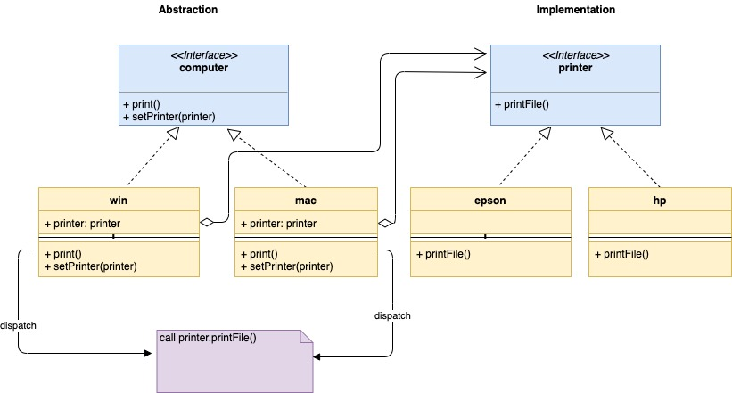
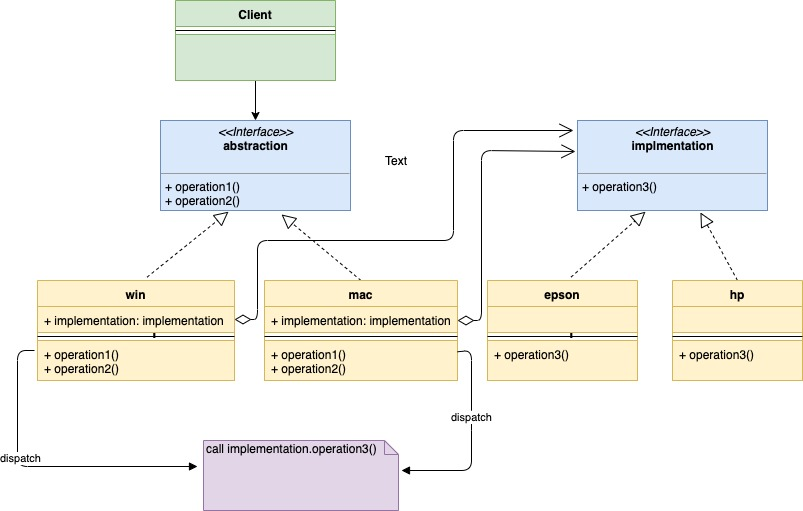

# Шаблон проектирования "Мост" в Go

[Оригинал](https://golangbyexample.com/bridge-design-pattern-in-go/)

## Введение

Шаблон "Мост" — это структурный шаблон проектирования, который 
позволяет отделить абстракцию от ее реализации. Всё равно не понятно,
где его использовать? Не волнуйтесь, по ходу дела мы поясним всё на примере.

Этот шаблон предполагает разделение большого класса на две отдельные иерархии:

* абстракцию — это интерфейс, а дочерние элементы **абстракции** называются **уточненной 
  абстракцией**. Абстракция содержит ссылку на реализацию.
* реализацию — это также интерфейс и дочерние элементы **реализации** называются 
  **конкретной реализацией**.
  
Клиенты обращаются к иерархии абстракции, не беспокоясь о реализации. Рассмотрим
пример. Предположим, у вас есть два типа компьютеров **Mac** и **Windows**, а также,
допустим, два типа принтеров **Epson** и **Hp**. И компьютеры, и принтеры 
должны работать друг с другом в любой комбинации. Клиент, имеющий доступ только
к компьютеру, не должен беспокоится о том как происходит печать. Вместо того, 
чтобы создавать четыре структуры для комбинации 2 * 2, мы создаем две иерархии

* абстракции
* реализации

Смотри рисунок ниже. Эти две иерархии взаимодействуют друг с другом через мост,
где абстракция (в данном случае компьютер) содержит ссылку на реализацию (в данном 
случае принтер). И абстракция, и реализация могут продолжать развиваться 
независимо, не влияя друг на друга. Обратите внимание, как в `win` и `mac` 
встраивается ссылка на **принтер**. Мы можем изменить **реализацию абстракции**
(то есть принтер) во время выполнения, поскольку абстракция связана с реализацией
через интерфейс. При вызове `mac.print()` или `windows.print()` он отправляет 
запрос на `printer.printFile()`. Это можно считать мостом и благодаря такому 
поведению обеспечивается слабая связь между ними.


## UML диаграмма:



В таблице представлено соответствие между актёрами на UML диаграмме и файлами
из примера.

|  Актёр на UML диаграмме  | Файл из примера |
|:--------:|:-------:|
| Abstraction  | interfaces/computer.go  |
| Refined Abstraction 1 |   computer/mac.go  |
| Refined Abstraction 2 | computer/win.go |
| Implementation | interfaces/printer.go |
| Concrete Implementation 1 | printer/epson.go |
| Concrete Implementation 2 | printer/hp.go |
| Client   | main.go |

## Пример:

**interfaces/computer.go**

```go
type Computer interface {
    Print()
    SetPrinter(Printer)
}
```

**computer/mac.go**

```go
type mac struct {
    printer interfaces.Printer
}

func NewMac(printer interfaces.Printer) *mac {
    return &mac{
        printer: printer,
    }
}

func (m *mac) Print() {
    fmt.Println("Print request for mac")
    m.printer.PrintFile()
}

func (m *mac) SetPrinter(p interfaces.Printer) {
    m.printer = p
}
```

**computer/win.go**

```go
type windows struct {
    printer interfaces.Printer
}

func NewWindows(printer interfaces.Printer) *windows {
    return &windows{
        printer: printer,
    }
}

func (w *windows) Print() {
    fmt.Println("Print request for windows")
    w.printer.PrintFile()
}

func (w *windows) SetPrinter(p interfaces.Printer) {
    w.printer = p
}
```

**interfaces/printer.go**

```go
type Printer interface {
    PrintFile()
}
```

**printer/epson.go**

```go
type epson struct {
}

func NewEpson() *epson {
    return &epson{}
}

func (p *epson) PrintFile() {
    fmt.Println("Printing by a EPSON Printer")
}
```

**printer/hp.go**

```go
type hp struct {
}

func NewHp() *hp {
    return &hp{}
}

func (p *hp) PrintFile() {
    fmt.Println("Printing by a HP printer")
}
```

**main.go**

```go
func main() {
    hpPrinter := printer.NewHp()
    epsonPrinter := printer.NewEpson()
    macComputer := computer.NewMac(hpPrinter)
    macComputer.Print()
    fmt.Println()
    macComputer.SetPrinter(epsonPrinter)
    macComputer.Print()
    fmt.Println()
    winComputer := computer.NewWindows(hpPrinter)
    winComputer.Print()
    fmt.Println()
    winComputer.SetPrinter(epsonPrinter)
    winComputer.Print()
    fmt.Println()
}
```

```shell
go run main.go
Print request for mac
Printing by a HP printer

Print request for mac
Printing by a EPSON Printer

Print request for windows
Printing by a HP printer

Print request for windows
Printing by a EPSON Printer

```