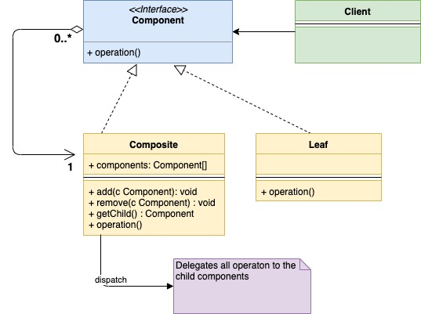

# Шаблон проектирования "Компоновщик" в Go

[Оригинал](https://golangbyexample.com/composite-design-pattern-golang/)

## Определение

Шаблон "Компоновщик" - это структурный шаблон проектирования, используемый
для группировки нескольких объектов в один "составной", с которым можно было бы 
работать как с единым объектом. Он относится к структурным шаблонам, поскольку
позволяет объединять объекты в древовидную структуру. С каждым из отдельных 
объектов в древовидной структуре можно работать одинаково, независимо от того,
являются они составными или примитивными. Попробуем разобраться с шаблоном
на примере файловой системы ОС. В ней существует два типа объектов: Файл (`File`)
и Папка (`Folder`). Бывают ситуации, когда файлы и папки обрабатываются одинаково.
Мы их рассмотрим в дальнейшем.

## Когда стоит использовать

* Шаблон "Компоновщик" стоит использовать в случаях, когда составной и примитивный
  объект нужно рассматривать одинаково с точки зрения клиента. В вышеприведенном 
  примере с файловой системой пусть необходимо выполнить операцию **поиска** по 
  определенному ключевому слову. Эту операцию поиска можно применять как к 
  Файлу (`File`), так и к Папке (`Folder`). Для Файла она просто просматривает 
  содержимое файла, а для Папки она просматривает все файлы в иерархии этой
  папки, чтобы найти это ключевое слово.
  
* Используйте этот шаблон, когда составной и примитивный объект образуют 
  древовидную структуру. В нашем примере Файл и Папка образуют древовидную 
  структуру.

## UML диаграмма:

* `Component` - это интерфейс, который общие операции для объектов `Composite` и
  `Leaf`.
* `Composite` – реализует интерфейс `Component` и содержит встроенный массив 
   дочерних `Components`
* `Leaf` - это примитивный объект в дереве. Он также реализует интерфейс
  `Component`.



Ниже приведена соответствующая UML диаграмма для примера, описанного выше.


В таблице представлено соответствие между актёрами на UML диаграмме и файлами
из примера.

|  Актёр на UML диаграмме  | Файл из примера |
|:--------:|:-------:|
| Component interface  | interfaces/component.go  |
| Composite |   fileSystem/folder.go  |
| Leaf | fileSystem/file.go |
| client   | main.go |

## Пример:

В приведенном ниже примере - `Component` - это интерфейс, а `File` и `Folder` 
реализуют этот интерфейс.

**interfaces/component.go**

```go
type Component interface {
    Search(string)
}
```

**fileSystem/folder.go**

```go
type folder struct {
    components []interfaces.Component
    name       string
}

func NewFolder(name string) *folder {
    return &folder{
        name: name,
    }
}

func (f *folder) Search(keyword string) {
    fmt.Printf("Searching recursively for keyword %s in folder %s\n", keyword, f.name)
    for _, composite := range f.components {
        composite.Search(keyword)
    }
}

func (f *folder) Add(c interfaces.Component) {
    f.components = append(f.components, c)
}
```

**fileSystem/file.go**

```go
type file struct {
    name string
}

func NewFile(name string) *file {
    return &file{
        name: name,
    }
}

func (f *file) Search(keyword string) {
    fmt.Printf("Searching for keyword %s in file %s\n", keyword, f.name)
}

func (f *file) GetName() string {
    return f.name
}
```

**main.go**

```go
func main() {
    file1 := fileSystem.NewFile("File1")
    file2 := fileSystem.NewFile("File2")
    file3 := fileSystem.NewFile("File3")
    folder1 := fileSystem.NewFolder("Folder1")
    folder1.Add(file1)
    folder2 := fileSystem.NewFolder("Folder2")
    folder2.Add(file2)
    folder2.Add(file3)
    folder2.Add(folder1)
    folder2.Search("rose")
}
```

Результат в терминале:

```shell
go run main.go
Searching recursively for keyword rose in folder Folder2
Searching for keyword rose in file File2
Searching for keyword rose in file File3
Searching recursively for keyword rose in folder Folder1
Searching for keyword rose in file File1
```