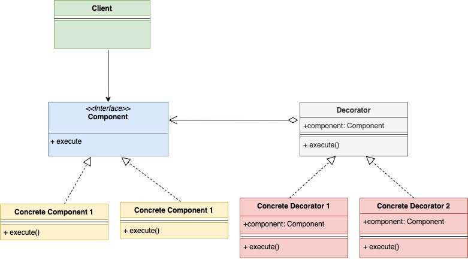

# Шаблон проектирования "Декоратор" в Go

[Оригинал](https://golangbyexample.com/decorator-pattern-golang/)

## Краткий обзор

Шаблон "Декоратор" — это структурный паттерн проектирования, который позволяет
добавлять объектам новую функциональность или дополнять объект, не изменяя его.

Проще всего понять шаблон на примере. Представьте, что вы открываете сеть 
пиццерий. Вы начали с двух видов пиццы

* Пицца Veggie Mania
* Пицца Peppy Tofu

У каждой из перечисленных пицц была своя цена. Итак, вы должны создать 
интерфейс пиццы, как показано ниже

```go
type pizza interface {
    getPrice() int
}
```

Вам также необходимо создать две структуры пиццы с функцией `getPrice`, 
которая вернет цену. Эти две структуры реализуют интерфейс `pizza`, поскольку в
них определён метод `getPrice()`.

Позже вы начали предлагать начинки вместе с пиццей за определенную доплату 
за каждую из них. Итак, оригинальную основу пиццы теперь нужно украсить 
начинкой. Представим, что вы добавили в меню следующие две начинки

* томатную начинку
* сырную начинку

Не забывайте, что пицца с начинкой всё равно является пиццей. У клиента появляется
множество вариантов заказать пиццу. Например,

* Veggie mania с томатной начинкой
* Veggie mania с томатной и сырной начинкой
* Peppy Tofu без какой-либо начинки
* Peppy Tofu c сырной начинкой
* ...

Возникает вопрос: как спроектировать систему с учётом начинок? Здесь на помощь 
приходит шаблон декоратор. Он может добавить функциональность без фактического
изменения каких-либо существующих структур. Для нашего случая шаблон "Декоратор"
рекомендует создать отдельные структуры для каждой доступной начинки. Каждая 
такая структура будет реализовывать вышеприведенный интерфейс пиццы, а также
иметь встроенный в себя экземпляр пиццы.

Теперь у нас есть отдельные структуры для различных типов пиццы и отдельные 
структуры для доступных типов начинки. У каждой пиццы и начинки своя цена.
И всякий раз, когда вы добавляете какую-либо начинку в пиццу, цена этой начинки
добавляется к базовой цене пиццы и таким образом, вы получаете итоговую цену.

Таким образом, "обернуть" исходный базовый объект `pizza`, не изменяя его. 
Объекту `pizza` ничего не известно о начинках. Он просто знает свою цену и 
ничего больше.

## UML диаграмма:

Ниже представлена UML диаграмма для шаблона проектирования "Декоратор"



Конкретный компонент (здесь Veggie Mania и Peppy Tofu) и конкретный декоратор 
(здесь Начинки (`Toppings`)) реализуют интерфейс компонента (здесь `Pizza`). Также
в конкретный декоратор будет встроен экземпляр компонента.

В приведенном ниже примере:

* компонент представлен интерфейсом `Pizza`
* конкретный компонент представлен структурами `veggieMania` и `peppyPanner`. 
  Они обе реализуют интерфейс `Pizza`
* конкретные декораторы представлены структурами `cheeseTopping` и `tomatoTopping`. 
  Обе реализуют интерфейс `Pizza`. Также в них строен экземпляр типа `Pizza`.
  
# Пример:

**interfaces/pizza.go**

```go
type Pizza interface {
    GetPrice() int
}
```

**pizza/peppyPaneer.go**

```go
type peppyPaneer struct {
}

func NewPeppyPaneer() *peppyPaneer {
    return &peppyPaneer{}
}

func (p *peppyPaneer) GetPrice() int {
    return 20
}
```

**pizza/veggeMania.go**

```go
type veggeMania struct {
}

func NewVeggeMania() *veggeMania {
    return &veggeMania{}
}

func (p *veggeMania) GetPrice() int {
    return 15
}
```

**topping/cheeseTopping.go**

```go
type cheeseTopping struct {
    pizza interfaces.Pizza
}

func NewCheeseTopping(pizza interfaces.Pizza) *cheeseTopping {
    return &cheeseTopping{pizza: pizza}
}

func (t *cheeseTopping) GetPrice() int {
    pizzaPrice := t.pizza.GetPrice()
    return pizzaPrice + 10
}
```

**topping/tomatoTopping.go**

```go
type tomatoTopping struct {
    pizza interfaces.Pizza
}

func NewTomatoTopping(pizza interfaces.Pizza) *tomatoTopping {
    return &tomatoTopping{pizza: pizza}
}

func (t *tomatoTopping) GetPrice() int {
    pizzaPrice := t.pizza.GetPrice()
    return pizzaPrice + 7
}
```

**main.go**

```go
func main() {
    veggiePizza := pizza.NewVeggeMania()
  
    // Добавляем сырную начинку
    veggiePizzaWithCheese := topping.NewCheeseTopping(veggiePizza)
  
    // Добавляем томатную начинку
    veggiePizzaWithCheeseAndTomato := topping.NewTomatoTopping(veggiePizzaWithCheese)
  
    fmt.Printf("Price of veggieMania pizza with tomato and cheese topping is %d\n", veggiePizzaWithCheeseAndTomato.GetPrice())
  
    peppyPaneerPizza := pizza.NewPeppyPaneer()
  
    // Добавляем сырную начинку
    peppyPaneerPizzaWithCheese := topping.NewCheeseTopping(peppyPaneerPizza)
  
    fmt.Printf("Price of peppyPaneer with cheese topping is %d\n", peppyPaneerPizzaWithCheese.GetPrice())
}
```

Результат в терминале:

```shell
go run main.go
Price of veggieMania pizza with tomato and cheese topping is 32
Price of peppyPaneer with cheese topping is 30
```