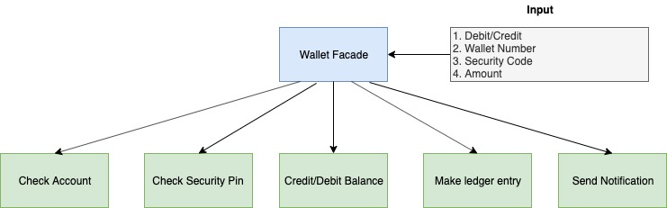
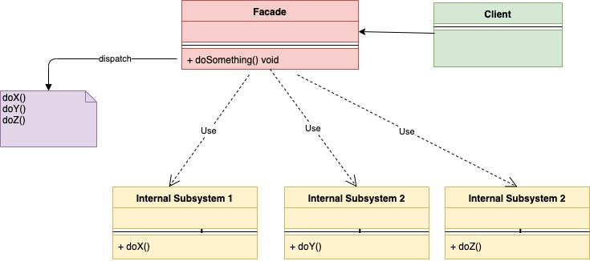
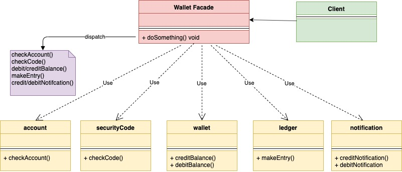

# Шаблон проектирования "Фасад" в Go

[Оригинал](https://golangbyexample.com/facade-design-pattern-in-golang)

## Определение

Шаблон "Фасад" - это структурный паттерн проектирования, предназначенный для 
скрытия сложностей системы и предоставления клиенту простого интерфейса. Он
обеспечивает унифицированный интерфейс для многих интерфейсов в системе, так
что с точки зрения клиента его проще использовать. По сути, шаблон 
обеспечивает более высокий уровень абстракции над сложной системой.

Сам термин **Фасад** означает

**основную, лицевую сторону здания, выходящую на улицу или открытое пространство**

Таким образом видна только лицевая сторона здания, а все сложные детали реализации 
скрыты за ней.

Давайте разберёмся с шаблоном проектирования "Фасад" на простом примере. В эпоху
повсеместного использования цифровых кошельков, при выполнении дебетовых/кредитных
операций, в фоновом режиме происходит множество вещей, о которых клиент может 
не знать. Ниже в списке показаны некоторые действия, которые происходят во время 
этих операций:

* Проверяем счёт
* Проверяем защитный PIN-код
* Изменяем дебетовый/кредитный баланс
* Добавляем операцию в журнал доходов/расходов
* Отправляем уведомление

Как видно, множество вещей происходит для одной дебетовой/кредитной операции.
Здесь нам пригодится шаблон "Фасад". Как клиенту нам нужно только ввести
номер кошелька, защитный PIN-код и указать тип операции. Всё остальное происходит
в фоновом режиме. Ниже мы создадим `WalletFacade`, который предоставит простой 
интерфейс клиенту и позаботится обо всех основных операциях.



## Постановка задачи:

При работе со сложной системой, клиент должен быть знаком с её деталями. 
Необходимо предоставить клиенту простой интерфейс, чтобы он мог использовать 
сложную систему без каких-либо знаний о её внутреннем сложном устройстве.

## Когда стоит использовать

* Если вы хотите представить сложную систему в упрощенном виде. Как в вышеприведенном 
  примере с цифровым кошельком, клиенту достаточно знать только один интерфейс, 
  который должен позаботиться обо всём остальном.

## UML диаграмма:



Ниже представлена соответствующая UML диаграмма для примера, показанного ниже.



В таблице представлено соответствие между актёрами на UML диаграмме и файлами
из примера.

|  Актёр на UML диаграмме  | Файл из примера |
|:--------:|:-------:|
| Wallet Facade  | wallet/walletFacade.go  |
| account |   account/account.go  |
| securityCode | account/securityCode.go |
| wallet | wallet/wallet.go |
| ledger | ledger/ledger.go |
| notification | notification/notification.go |
| Client   | main.go |

## Пример:

**wallet/walletFacade.go**

```go
type walletFacade struct {
    account      interfaces.Account
    wallet       interfaces.Wallet
    securityCode interfaces.SecurityCode
    notification interfaces.Notification
    ledger       interfaces.Ledger
}

func NewWalletFacade(accountID string, code int) *walletFacade {
    fmt.Println("Starting create account")
    walletFacade := &walletFacade{
        account:      account.NewAccount(accountID),
        securityCode: account.NewSecurityCode(code),
        wallet:       NewWallet(),
        notification: notification.NewNotification(),
        ledger:       ledger.NewLedger(),
    }
    fmt.Println("Account created")
    return walletFacade
}

func (w *walletFacade) AddMoneyToWallet(accountID string, securityCode int, amount int) error {
    fmt.Println("Starting add money to wallet")
    err := w.account.CheckAccount(accountID)
    if err != nil {
        return err
    }
    err = w.securityCode.CheckCode(securityCode)
    if err != nil {
        return err
    }
    w.wallet.CreditBalance(amount)
    w.notification.SendWalletCreditNotification()
    w.ledger.MakeEntry(accountID, "credit", amount)
    return nil
}

func (w *walletFacade) DeductMoneyFromWallet(accountID string, securityCode int, amount int) error {
    fmt.Println("Starting debit money from wallet")
    err := w.account.CheckAccount(accountID)
    if err != nil {
        return err
    }
    err = w.securityCode.CheckCode(securityCode)
    if err != nil {
        return err
    }
    err = w.wallet.DebitBalance(amount)
    if err != nil {
        return err
    }
    w.notification.SendWalletDebitNotification()
    w.ledger.MakeEntry(accountID, "debit", amount)
    return nil
}
```

**account/account.go**

```go
type account struct {
    name string
}

func NewAccount(accountName string) *account {
    return &account{
        name: accountName,
    }
}

func (a *account) CheckAccount(accountName string) error {
    if a.name != accountName {
        return fmt.Errorf("account name is incorrect")
    }
    fmt.Println("Account Verified")
    return nil
}
```

**account/securityCode.go**

```go
type securityCode struct {
    code int
}

func NewSecurityCode(code int) *securityCode {
    return &securityCode{
        code: code,
    }
}

func (s *securityCode) CheckCode(incomingCode int) error {
    if s.code != incomingCode {
        return fmt.Errorf("security code is incorrect")
    }
    fmt.Println("SecurityCode Verified")
    return nil
}
```

**wallet/wallet.go**

```go
type wallet struct {
    balance int
}

func NewWallet() *wallet {
    return &wallet{
        balance: 0,
    }
}

func (w *wallet) CreditBalance(amount int) {
    w.balance += amount
    fmt.Println("Wallet balance added successfully")
    return
}

func (w *wallet) DebitBalance(amount int) error {
    if w.balance < amount {
        return fmt.Errorf("balance is not sufficient")
    }
    fmt.Println("Wallet balance is sufficient")
    w.balance = w.balance - amount
    return nil
}
```

**ledger/ledger.go**

```go
type ledger struct {
}

func NewLedger() *ledger {
    return &ledger{}
}

func (l *ledger) MakeEntry(accountID string, txnType string, amount int) {
    fmt.Printf("Make ledger entry for accountId %s with txnType %s for amount %d\n", accountID, txnType, amount)
}
```

**notification/notification.go**

```go
type notification struct {
}

func NewNotification() *notification {
    return &notification{}
}

func (n *notification) SendWalletCreditNotification() {
    fmt.Println("Sending wallet credit notification")
}

func (n *notification) SendWalletDebitNotification() {
    fmt.Println("Sending wallet debit notification")
}
```

**main.go**

```go
func main() {
    fmt.Println()
    walletFacade := wallet.NewWalletFacade("abc", 1234)
    fmt.Println()
    err := walletFacade.AddMoneyToWallet("abc", 1234, 10)
    if err != nil {
        log.Fatalf("Error: %s\n", err.Error())
    }
    fmt.Println()
    err = walletFacade.DeductMoneyFromWallet("abc", 1234, 5)
    if err != nil {
        log.Fatalf("Error: %s\n", err.Error())
    }
}
```

Результат в терминале:

```shell
go run main.go

Starting create account
Account created

Starting add money to wallet
Account Verified
SecurityCode Verified
Wallet balance added successfully
Sending wallet credit notification
Make ledger entry for accountId abc with txnType credit for amount 10

Starting debit money from wallet
Account Verified
SecurityCode Verified
Wallet balance is sufficient
Sending wallet debit notification
Make ledger entry for accountId abc with txnType debit for amount 5
```