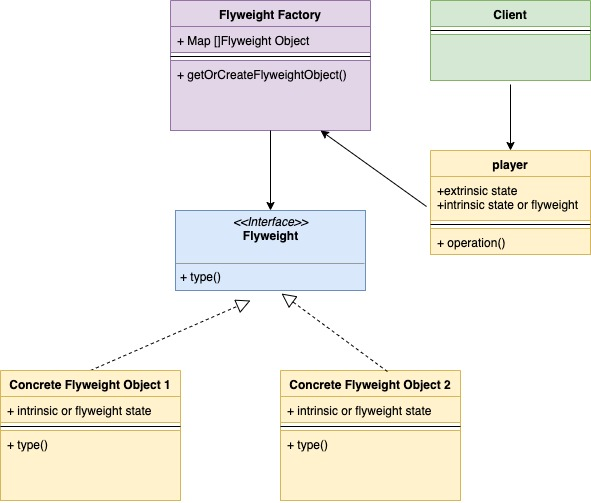
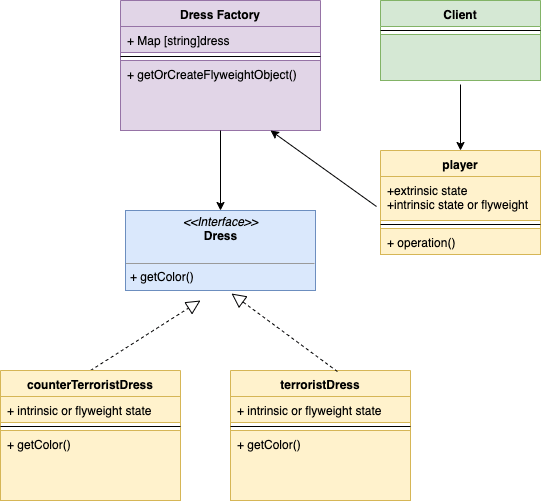

# Шаблон проектирования "Приспособленец" в Go

[Оригинал](https://golangbyexample.com/flyweight-design-pattern-golang/)

Это структурный шаблон проектирования. Он используется, когда необходимо 
создать большое количество похожих объектов. Эти объекты называются легковесами
и не изменяются.

Давайте сначала рассмотрим пример. После него станет понятно как использовать 
шаблон "Приспособленец".

В игре Counter-Strike у террориста и спецназовца разный тип одежды. Для простоты
предположим, что и у террористов, и у спецназовцев всего по одному типу одежды. 
Ниже представлена структура Игрок (`player`), мы видим, что объект Одежда (`dress`)
встроен в структуру Игрок.

```go
type player struct {
    dress      dress
    playerType string // может быть T (террорист) или CT (спецназовец)
    lat        int
    long       int
}
```

Пусть в игре 5 террористов и 5 спецназовцев, то есть всего 10 игроков. Существует 
два варианта инициализации объекта Одежда:

1) Каждый из 10 объектов Игрок создаёт свой собственный объект Одежда и 
   встраивает его. Всего будет создано 10 объектов Одежда.
2) Мы создаём два объекта Одежда:
   * Один объект Одежда для террориста: он будет общим для всех 5 террористов
   * Один объект Одежда для спецназовца: он будет общим для всех 5 спецназовцев
    
Как видите в первом варианте создаётся все 10 объектов Одежда, в то время как
во втором варианте только 2 объекта. Второй подход используется в шаблоне 
проектирования "Приспособленец". Два созданных нами объекта Одежда называются
легковесными объектами. Шаблон "Приспособленец" отделяет общие части и создаёт 
легковесные объекты. Эти легковесные объекты (здесь Одежда) могут совместно 
использоваться несколькими объектами (здесь Игроками). Это резко уменьшает
число объектов Одежда и даже если вы создадите больше игроков всё равно будет 
достаточно только двух предметов Одежда.

В шаблоне "Приспособленец" мы храним легковесные объекты в карте. Каждый раз, 
когда создаются другие объекты, которые имеют общие объекты-легковесы, 
объекты-легковесы извлекаются из карты.

### Внутреннее и внешнее состояния

* Внутреннее состояние — объект Одежда является внутренним состоянием, поскольку
  он может использоваться несколькими объектами Террорист и Спецназовец.
* Внешнее состояние — местоположение игрока и его оружие являются внешними 
  состояниями, поскольку они различны для каждого объекта.

## Когда стоит использовать

* Когда объекты обладают некоторыми внутренними свойствами, которыми могут 
  совместно использоваться. В вышеприведенном примере, Одежда — внутреннее 
  состояние, которое отделяется и совместно используется.
* Используйте легковес, когда необходимо создать большое количество объектов,
  что может привести к проблемам с памятью. В этом случае определите все общие
  или внутренние состояния и создайте для них легковесные объекты.

## UML диаграмма:



Ниже представлена соответствующая UML диаграмма для примера, показанного ниже.



В таблице представлено соответствие между актёрами на UML диаграмме и файлами
из примера.

|  Актёр на UML диаграмме  | Файл из примера |
|:--------:|:-------:|
| Flyweight Factory  | dress/dressFactory.go  |
| Flyweight Interface |   interfaces/dress.go  |
| Concrete Flyweight Object 1 | dress/terroristDress.go |
| Concrete Flyweight Object 2 | dress/counterTerroristDress.go |
| Context | player/player.go |
| Client   | main.go |

## Пример:

**dress/dressFactory.go**

```go
const (
    // TerroristDressType константа для одежды террориста
    TerroristDressType = "tDress"
    // CounterTerroristDressType константа для одежды спецназовца
    CounterTerroristDressType = "ctDress"
)

var (
    dressFactorySingleInstance = &dressFactory{
        dressMap: make(map[string]interfaces.Dress),
    }
)

type dressFactory struct {
    dressMap map[string]interfaces.Dress
}

func (d *dressFactory) GetDressByType(dressType string) (interfaces.Dress, error) {
    if d.dressMap[dressType] != nil {
        return d.dressMap[dressType], nil
    }
    if dressType == TerroristDressType {
        d.dressMap[dressType] = NewTerroristDress()
        return d.dressMap[dressType], nil
    }
    if dressType == CounterTerroristDressType {
        d.dressMap[dressType] = NewCounterTerroristDress()
        return d.dressMap[dressType], nil
    }
    return nil, fmt.Errorf("wrong dress type passed")
}

func GetDressFactorySingleInstance() *dressFactory {
    return dressFactorySingleInstance
}
```

**interfaces/dress.go**

```go
type Dress interface {
    GetColor() string
}
```

**dress/terroristDress.go**

```go
type terroristDress struct {
    color string
}

func NewTerroristDress() *terroristDress {
    return &terroristDress{color: "red"}
}

func (t *terroristDress) GetColor() string {
    return t.color
}
```

**dress/counterTerroristDress.go**

```go
type counterTerroristDress struct {
    color string
}

func NewCounterTerroristDress() *counterTerroristDress {
    return &counterTerroristDress{color: "green"}
}

func (c *counterTerroristDress) GetColor() string {
    return c.color
}
```

**player/player.go**

```go
type player struct {
    dress      interfaces.Dress
    playerType string
    lat        int
    long       int
}

func NewPlayer(playerType, dressType string) *player {
    pDress, _ := dress.GetDressFactorySingleInstance().GetDressByType(dressType)
    return &player{
        playerType: playerType,
        dress:      pDress,
    }
}

func (p *player) NewLocation(lat int, long int) {
    p.lat = lat
    p.long = long
}

func (p *player) GetPlayerType() string {
    return p.playerType
}

func (p *player) GetDressColor() string {
    return p.dress.GetColor()
}
```

**main.go**

```go
func main() {
    player1 := player.NewPlayer("T", dress.TerroristDressType)
    player2 := player.NewPlayer("T", dress.TerroristDressType)
    player3 := player.NewPlayer("CT", dress.CounterTerroristDressType)
    player4 := player.NewPlayer("CT", dress.CounterTerroristDressType)
    fmt.Printf("Player 1 type %s, dress color %s\n", player1.GetPlayerType(), player1.GetDressColor())
    fmt.Printf("Player 2 type %s, dress color %s\n", player2.GetPlayerType(), player2.GetDressColor())
    fmt.Printf("Player 3 type %s, dress color %s\n", player3.GetPlayerType(), player3.GetDressColor())
    fmt.Printf("Player 4 type %s, dress color %s\n", player4.GetPlayerType(), player4.GetDressColor())
}
```

Результат в терминале:

```shell
go run main.go
Player 1 type T, dress color red
Player 2 type T, dress color red
Player 3 type CT, dress color green
Player 4 type CT, dress color green
```