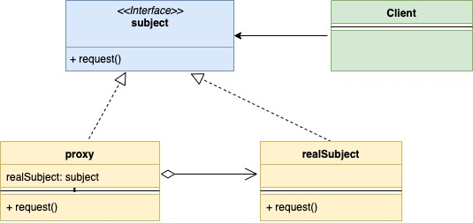
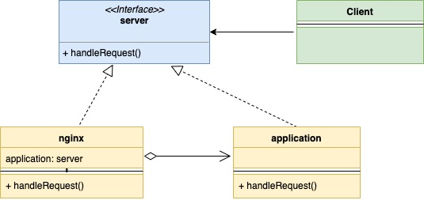

# Шаблон проектирования "Прокси" в Go

[Оригинал](https://golangbyexample.com/proxy-design-pattern-in-golang/)

Шаблон "Прокси" - это структурный шаблон проектирования, обеспечивает 
дополнительный уровень для контролируемого и подчиняющегося определенным 
правилам доступа к основному объекту.

В этом шаблоне создаётся новый прокси-класс, реализующий тот же интерфейс, что и
основной объект. Это позволяет вам добавлять какое-то поведение до фактической 
логики основного объекта. Давайте разберём это подробно на примере.

1. Дебетовая карта — это прокси вашего банковского счёта. Она имеет тот же интерфейс,
что и банковский счёт, и её проще использовать.

2. Веб-сервер, например, Nginx, может выступать в качестве прокси для вашего 
сервера приложений. Он обеспечивает 
    * контролируемый доступ к вашему серверу приложений — например, может 
      ограничивать число запросов.
    * дополнительное поведение — например, может выполнять кеширование.

## UML диаграмма:

На нижеприведенной диаграмме:

* **Subject** - это интерфейс, которому должен удовлетворять прокси и 
  `realSubject`
* **Proxy** - в класс `proxy` внедрен `realSubject` и он передаёт запрос в 
  `realSubject` после того как сам обработает его.
*  **RealSubject** - этот класс содержит основную бизнес-логику и находится за
  прокси.
* **Client** - может взаимодействовать как с `proxy`, так и с `realSubject`,
  поскольку оба реализуют один и тот же интерфейс.



Ниже представлена соответствующая UML диаграмма для примера с nginx и сервером
приложения, описанного выше.



В таблице представлено соответствие между актёрами на UML диаграмме и файлами
из примера.

|  Актёр на UML диаграмме  | Файл из примера |
|:--------:|:-------:|
| subject  | interfaces/server.go  |
| proxy |   app/nginx.go  |
| realSubject | app/application.go |
| client   | main.go |

## Пример:

**interfaces/server.go**

```go
type Server interface {
	HandleRequest(string, string) (int, string)
}
```

**app/nginx.go**

```go
type nginx struct {
    application       interfaces.Server
    maxAllowedRequest int
    rateLimiter       map[string]int
}

func NewNginxServer() *nginx {
    return &nginx{
        application:       &application{},
        maxAllowedRequest: 2,
        rateLimiter:       make(map[string]int),
    }
}

func (n *nginx) HandleRequest(url string, method string) (int, string) {
    allowed := n.checkRateLimiting(url)
    if !allowed {
        return 403, "Not Allowed"
    }
    return n.application.HandleRequest(url, method)
}

func (n *nginx) checkRateLimiting(url string) bool {
    if n.rateLimiter[url] == 0 {
        n.rateLimiter[url] = 1
    }
    if n.rateLimiter[url] > n.maxAllowedRequest {
        return false
    }
    n.rateLimiter[url] = n.rateLimiter[url] + 1
    return true
}
```

**app/application.go**

```go
type application struct {
}

func (a *application) HandleRequest(url string, method string) (int, string) {
    if url == "/app/status" && method == "GET" {
        return 200, "OK"
    }
    if url == "/create/user" && method == "POST" {
        return 201, "User Created"
    }
    return 404, "Not Found"
}
```

**main.go**

```go
func main() {
    nginxServer := app.NewNginxServer()
    appStatusURL := "/app/status"
    createUserURL := "/create/user"
    httpCode, body := nginxServer.HandleRequest(appStatusURL, "GET")
    fmt.Printf("\nUrl: %s\nHttpCode: %d\nBody: %s\n", appStatusURL, httpCode, body)
    httpCode, body = nginxServer.HandleRequest(appStatusURL, "GET")
    fmt.Printf("\nUrl: %s\nHttpCode: %d\nBody: %s\n", appStatusURL, httpCode, body)
    httpCode, body = nginxServer.HandleRequest(appStatusURL, "GET")
    fmt.Printf("\nUrl: %s\nHttpCode: %d\nBody: %s\n", appStatusURL, httpCode, body)
    httpCode, body = nginxServer.HandleRequest(createUserURL, "POST")
    fmt.Printf("\nUrl: %s\nHttpCode: %d\nBody: %s\n", createUserURL, httpCode, body)
    httpCode, body = nginxServer.HandleRequest(createUserURL, "GET")
    fmt.Printf("\nUrl: %s\nHttpCode: %d\nBody: %s\n", createUserURL, httpCode, body)
}
```

Результат в терминале:

```shell
go run main.go

Url: /app/status
HttpCode: 200
Body: OK

Url: /app/status
HttpCode: 200
Body: OK

Url: /app/status
HttpCode: 403
Body: Not Allowed

Url: /create/user
HttpCode: 201
Body: User Created

Url: /create/user
HttpCode: 404
Body: Not Found
```